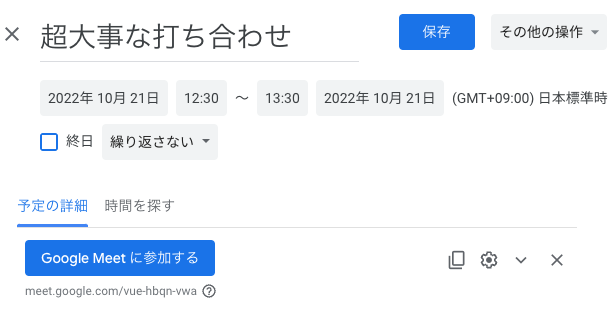

# リモート会議の存在を忘れるので、パソコンに「2分後にxxx会議があります」としゃべってもらうようにした

こんにちは。MIXI 開発本部 SREグループの [riddle](https://twitter.com/riddle_tec) です。

オンライン会議してますか？

リモートワークが当たり前になりたくさんのオンライン会議に参加してきました。

オンライン会議の課題は
- 相手の表情が見えにくい
- 声が聞き取りづらい
- 回線が悪くなる
- 視線が合わない

などさまざまあると思います。
しかし個人的に1番の問題は会議の存在を忘れることです!!!!

※オフラインのときは忘れてても周りの人が動いたタイミングで気づけた

システムで何とかサポートしてほしいので、規定の時刻になったら会議の存在を教えてくれるスクリプトを作りました。


# 実際の利用イメージ

こんな予定があったとします。超大事ですね。
  

今回紹介するスクリプトを使うと、しゃべって教えてくれる上に Google Meets のリンクも開いてくれます！
これで忘れても強制的に表示されるのでいい感じですね！


https://github.com/insanum/gcalcli
https://arimasou16.com/blog/2021/02/17/00371/

# スクリプト

自分1人で使うだけだったので非常に限定的な環境でのみ動きます

- Mac 
- Google Cloud Project を持っている
- bash がわかる
- Google Calender / Google Meets を使っている
 
[insanum/gcalcli: Google Calendar Command Line Interface](https://github.com/insanum/gcalcli#login-information)

gcalcli 認証
TODO:

```
❯ crontab -e
MAILTO=""
* * * * * $HOME/bin/tools/calendar/tell-schedule.sh 2 1> /dev/null 2> /tmp/calc.log
```

# まとめ

- オンライン会議忘れがち
- そうだ Siri に教えてもらおう！
- ついでに Google Meets も起動してもらおう！
