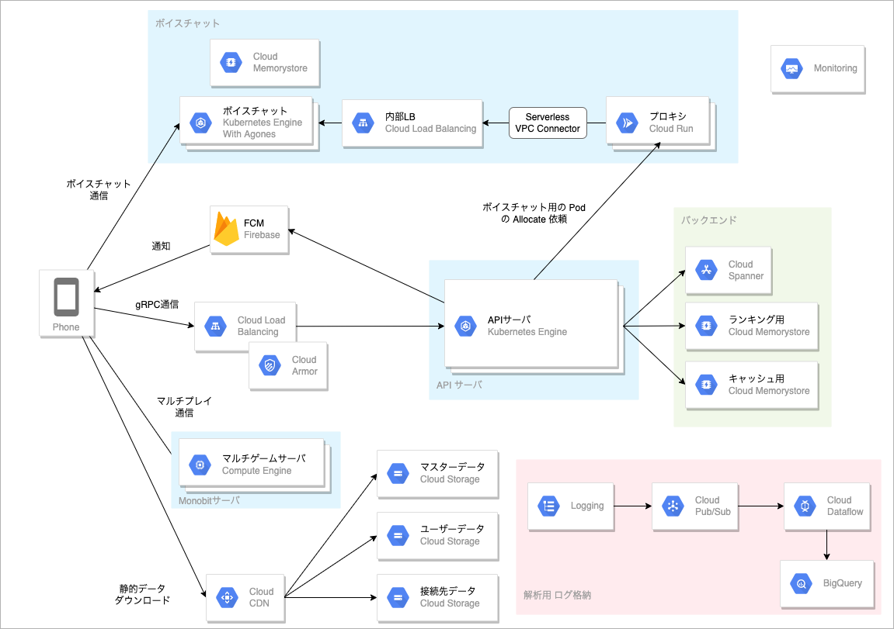
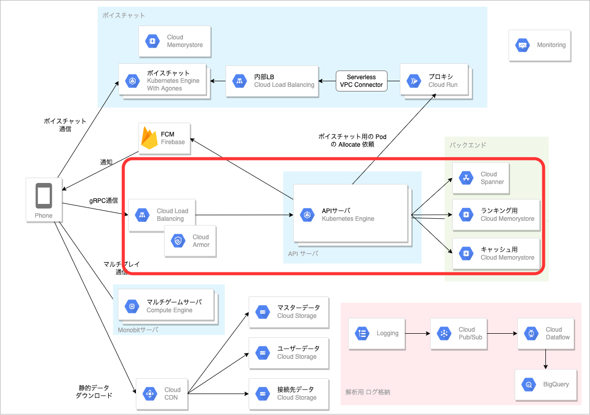
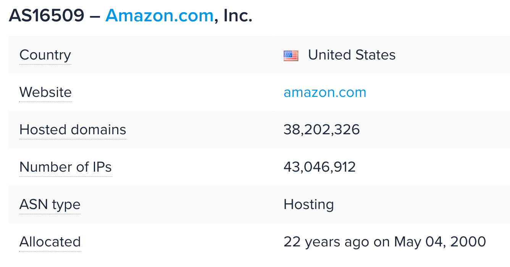
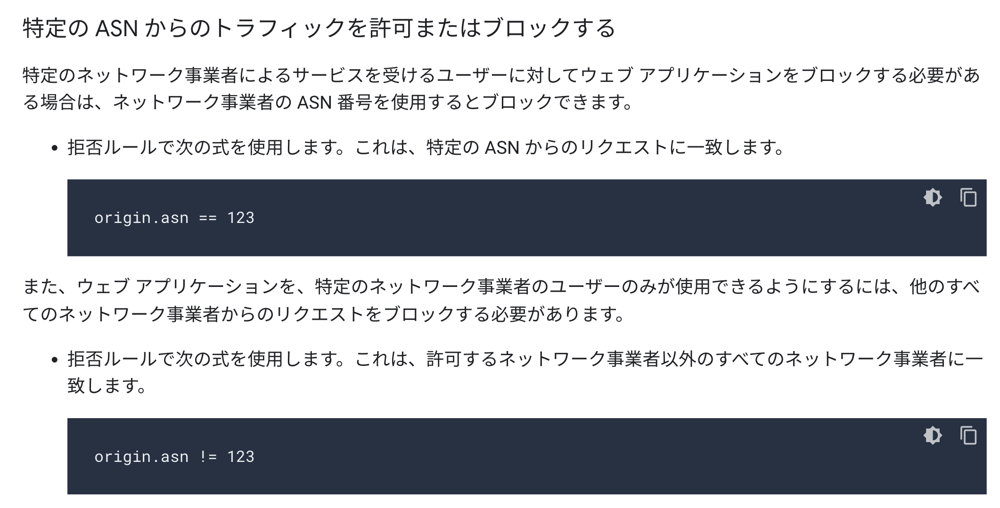

# スマホゲームへの不正アクセスを Cloud Armor と AS番号でブロックする

こんにちは。ミクシィの 開発本部 SREグループ の [riddle](https://twitter.com/riddle_tec) です。

https://youtu.be/kNGOW8RcBbA

私はゴーストスクランブルというスマホゲームを開発しています。

> ゴーストスクランブル（以下、ストブルと略します）は、弊社のモンストシリーズ最新作として2022年7月にリリースされたスマホゲームです。マルチプレイとボイスチャット機能を搭載していて、最大4人でマルチプレイができます。
>
> [ゴーストスクランブル（ストブル）公式サイト](https://ghost-scramble.com/)

ストブルは Google Cloud をつかっていて、GKE や Spanner をつかっています。

  

※詳しくは [スマホゲームのゴーストスクランブルの裏側を支える技術](https://mixi-developers.mixi.co.jp/stble-over-view-ab9bc69f5819) 

今回はストブルにおける「**サーバへの不正アクセスの対策方法**」を紹介します。

# スマホゲームでの不正アクセス

  

一般的にゲームの APIサーバにはリリース当初から、業者や好奇心旺盛な人から不正アクセスが大量に飛んできます。
※この記事における不正アクセスとは意図しないパラメーターを埋め込んだリクエストや、正規のクライアントを使わずに送信されるリクエストを指します

ストブルでもサーバ・クライアント間で鍵やパスワードを利用して認証を行なっていますが、クライアントはあ解析されるので遅かれ早かれサーバに**不正なリクエストが飛んできます。**

不正なリクエストによって大量にユーザを作成されると、DBレコードやユーザごとに作成されるファイルなど余計なデータが増えますし、サーバにも負荷がかかるのでいいことがありません。またゲームの種類によっては、不正に高得点をとったり他のユーザが不利益を被ることもあります。

このように不正ユーザの存在は百害あって一利なしですが、対策はいたちごっこになりやすく非常に大変です。
そこで今回は**不正ユーザを作らせにくくする低コストな方法**を紹介します。

この辺りの話です。
  


# よくある IP アドレス制限

  

よく使われるテクニックとして **不正ユーザの送信元 IP アドレスをブロックする方法** があります。
これは FireWall にルールを足すだけなのでとても簡単です。

しかしいくつか問題点があります。
1. 不正ユーザが IP アドレスを変えると効果がなくなる
2. 登録できる IP アドレスに上限がある

クラウドで手軽にグローバル IP が取得できるようになった昨今、攻撃者はサーバを再起動するだけで新しい IP アドレスを使用できます。仮に変更後の IP アドレスを毎回登録していくとしても今度は FireWall のルール数の上限に引っかかってしまいます。

また攻撃者が AWS を利用して不正アクセスツールを動かしている場合は、[AWS の IP アドレスリスト]((https://docs.aws.amazon.com/ja_jp/general/latest/gr/aws-ip-ranges.html))を FireWall に登録してアクセスをブロックできますが、IP アドレスリストは動的に変わりますし IP アドレスの数も膨大です。

AWS の IP アドレス数
```bash
❯ curl -sS https://ip-ranges.amazonaws.com/ip-ranges.json | jq -r ".|.prefixes|length"
7193
```

またクラウドプロバイダーによってはそもそも IP アドレスリストを公開していない場合もあります。

# 自律システム番号（ASN）について

  


現在のインターネットは ISP や通信事業者、クラウドプロバイダーが保有するネットワークを相互に接続して形作られています。この各ネットワークを自立システム（AS : Autonomous System) と呼び、それぞれ番号(AS Number)が割り振られています。

- [AS番号とは - 意味をわかりやすく - IT用語辞典 e-Words](https://e-words.jp/w/AS%E7%95%AA%E5%8F%B7.html)

各 AS 内のルータは、別の AS との通信を行うために BGP(ルーティングプロトコル) を用いて経路情報を交換します。このときお互いのルータは **「どの AS が何の IP アドレスを持っているのか？」** を交換し、通信先への最短経路を記憶します。

そのため ASN を調べると ASN に紐づく IP アドレスを取得できます。

たとえば、以下のリンクには AWS の ASN(`AS16509`) に紐づく IP アドレスがまとまっています。

https://ipinfo.io/AS16509

このサイトによると Amazon の ASN には `43,046,912` 個の IP アドレスが存在します。
  

# Cloud Armor で ASN を利用する


`43,046,912` 個の IP アドレスをすべて登録することは現実的じゃないですね。
しかし `AS16509` を1つ登録したら、この ASN に紐づくすべての IP アドレスがブロックできるとしたら便利じゃないですか？

Google Cloud の Cloud Armor にはまさにそのための機能が存在します！
  

https://cloud.google.com/armor/docs/rules-language-reference?hl=ja#allow_or_deny_traffic_from_a_specific_asn

これにより不正ユーザが AWS や Azure を使っても、AWS と Azure の ASN を登録するだけで済みます。また IP アドレスを変えられたとしてもそのクラウド内であればすべてブロックしているので、引き続きブロックできます。

またASN は **「誰が取得しているのか？」** が簡単にわかるため、IP アドレスを公開していない Alibaba Cloud(アリババクラウド) のようなサービスでも [AS6824](https://www.peeringdb.com/net/6824) や [AS15604](https://www.peeringdb.com/net/15604) あたりを登録しておくと不正アクセスを弾けます。


## Terraform コード

我々は Terraform を使っているので、
以下のコードで ASN(不正ユーザが使ってる IP アドレスに関連) を追加しています。

```hcl
resource "google_compute_security_policy" "policy" {
  name        = "block-from-specific-asn"

  dynamic "rule" {
    for_each = {
      for idx, asn in local.block_asn_number_sorted_list :
      idx => asn
    }
    iterator = it
    content {
      action   = "deny(404)"
      priority = tostring(1 + it.key)
      match {
        expr {
          expression = "origin.asn == ${it.value}"
        }
      }
      description = "Deny access from specific ASNs (${it.key})"
    }
  }

  ... 以下 allow rule を書く
}

locals {
  # ブロックしたい ASN を羅列する
  block_asn_number_sorted_list = sort([
    1234
    4567
    8888
    ...
  ])
}
```

# まとめ

- ASN という便利なものがある
- ASN には IP アドレスが紐づいている
- Google Cloud の Cloud Armor を使うと ASN でのブロックができる

2022/09 現在、AWS では ASN によるブロッキングはできないとのことです。
他のクラウドでも使えるようになればもっと便利になりそうですね！
