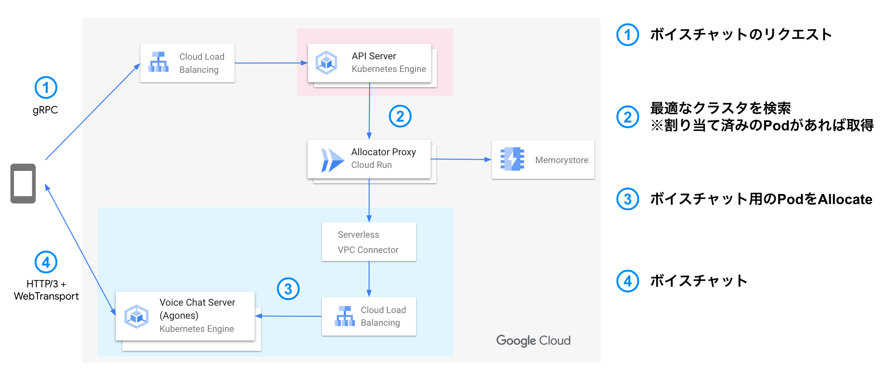

# title

こんにちは。ミクシィの 開発本部 SREグループ の [riddle](https://twitter.com/riddle_tec) です。

https://youtu.be/kNGOW8RcBbA

私はゴーストスクランブルというスマホゲームを開発しています。

> ゴーストスクランブル（以下、ストブルと略します）は、弊社のモンストシリーズ最新作として2022年7月にリリースされたスマホゲームです。マルチプレイとボイスチャット機能を搭載していて、最大4人でマルチプレイができます。
>
> [ゴーストスクランブル（ストブル）公式サイト](https://ghost-scramble.com/)

ストブルは Google Cloud をつかっていて、GKE や Spanner をつかっています。

  

※詳しくは [スマホゲームのゴーストスクランブルの裏側を支える技術](https://mixi-developers.mixi.co.jp/stble-over-view-ab9bc69f5819) 

今回はストブルにおける「**ボイスチャットの仕組み**」を紹介します。

なお詳しい音声パケットルーティングに関する話やクライアント側の実装は扱わず、サーバ構成や Agones の話を紹介します。

扱うのはこの範囲です！
  

# ボイスチャットについて

ストブルではマッチングルームに人が集まってクエストを開始するのですが、同じルームに集まった人とボイスチャットができます。

このとき裏側ではユーザ間で音声交換をするアプリが Kubernetes(以後 k8s と略します) 上で Pod が起動しています。(以後 Pod のことをボイチャルームと呼びます)

ボイチャルームは音声交換をするため「このボイチャルームには誰が接続できるのか？」や「ゲーム終了後には不要になるので削除する」と API サーバや Web サーバとは異なる性質を持っています。

そのためボイチャルームを k8s の標準のリソース(Deployment / StatefulSet) で扱うことが非常に難しいです。しかし k8s の可用性や拡張性を運用者があまり考えなくて良い仕組みは魅力的なので、どうにかこれらを組み合わせていい感じに運用したいですね。

そこで使われる考え方として *Dedicated Game Server* (以下 DGS と略す) があります。詳しい説明は以下のサイトをご覧ください。

> 世界中で配信され、オンラインで同時プレイされるような、大人数で動きの速いマルチプレイゲームでは、多くの場合ゲームの世界を可能な限りリアルタイムに近い速度でシミュレートするために、プレイヤーが接続する専用ゲームサーバーが必要です。この専用ゲームサーバーを「Dedicated Game Server（以下、DGS）」と呼び、DGSはプレイヤーのステート（状態）を管理する役割を果たします。

> [AgonesとGame Serversを使ってKubernetes上でリアルタイム マルチ対戦ゲーム環境（DGS）を構築する方法](https://ascii.jp/elem/000/004/062/4062051/) より引用

GKE + Agones を使用すると DGS が手軽に実現できます。

# Agones 

Agones は Ubisoft と Google が共同開発している OSSで、k8s 上で動かすアプリケーションです。Agones を使うと k8s にカスタムリソースを追加でき、ゲームルームをうまく管理してくれます。

- Pod にプレイヤーが接続中かどうか
- Pod の数が最適か？(ゲーム開始中じゃない Pod が一定数あるか)

Agones 周りの解説はこちらの記事がとても詳しいです。

- [AgonesとGame Serversを使ってKubernetes上でリアルタイム マルチ対戦ゲーム環境（DGS）を構築する方法](https://ascii.jp/elem/000/004/062/4062051/)
- [Agones 超入門. この記事は Google Cloud Japan Customer… | by Yutty Kawahara | google-cloud-jp | Medium](https://medium.com/google-cloud-jp/agones-beginner-jp-5a6553e7e9a4)

# ストブルにおける Agones + GKE の設計

ストブルにおけるボイチャルームを立てる時のユーザの動きを紹介します。

1. Aさん: マッチングルームに入る
2. Bさん: マッチングルームに入る
3. Aさん: ボイスチャット開始ボタンを押す(誰も入ってないので通話できず)
4. Aさん: ボイスチャット開始ボタンを押す(Aさんと通話できる)
5. Cさん: マッチングルームに入る
6. Cさん: ボイスチャット開始ボタンを押す(Aさん/Bさんと通話できる)

上記の3番で①の gRPC リクエストが叩かれます。

  

裏側ではボイスチャットを始める際に以下のフローが行われています。

TODO: aria-server / aria-allocator を紹介する
1. クライアントがAPI サーバにボイスチャット開始リクエストを送る
2. マッチングルームに紐づくボイチャルームがあるか？を検索
3. ボイチャルームが存在しない場合は GKE + Agones 上に動いているアプリにリクエストを投げ、ボイチャルームを作成
   API サーバは作成したボイチャルーム情報と認証コードをクライアントに返却
4. クライアントがボイチャルームに接続

以降、BやCがアクセスする際はすでにボイチャルームがあるので2番の段階で情報を取得できます。

# インフラ設計

- VPC
- cloud run
- マルチクラスタ
