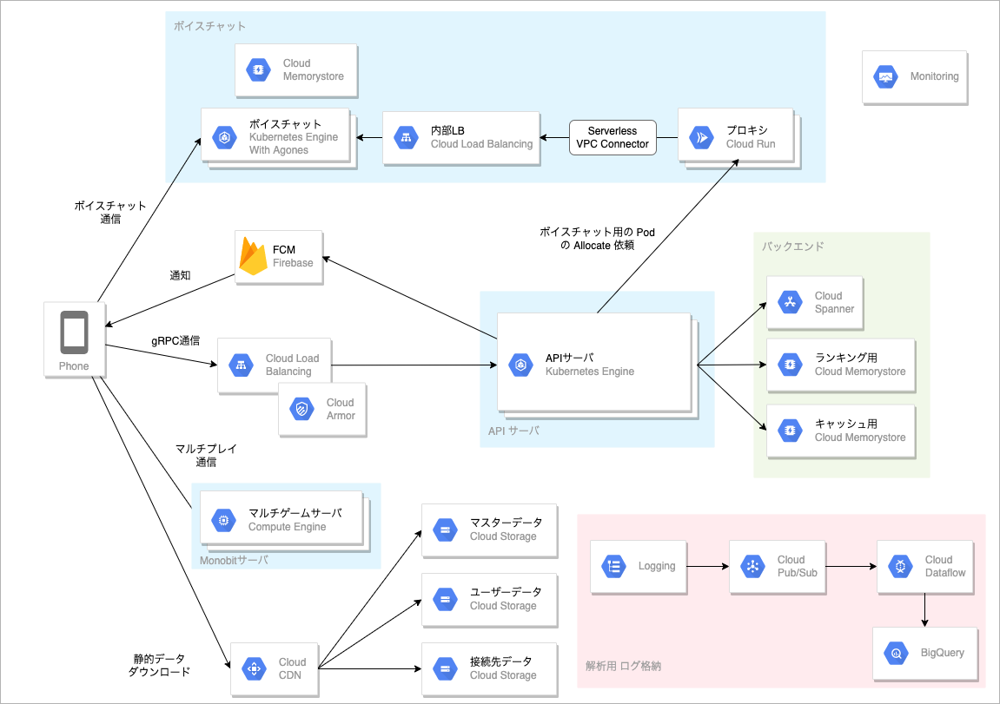
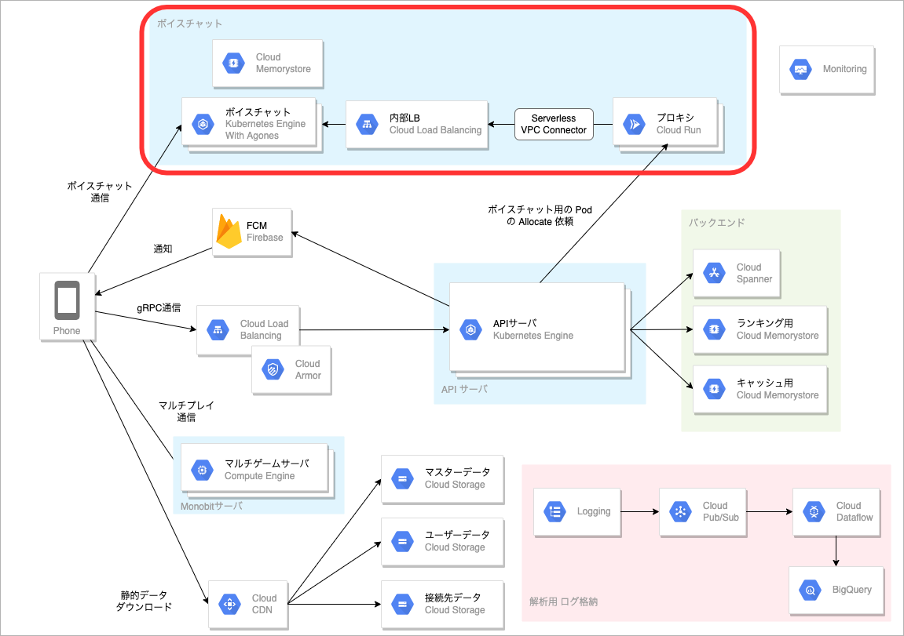
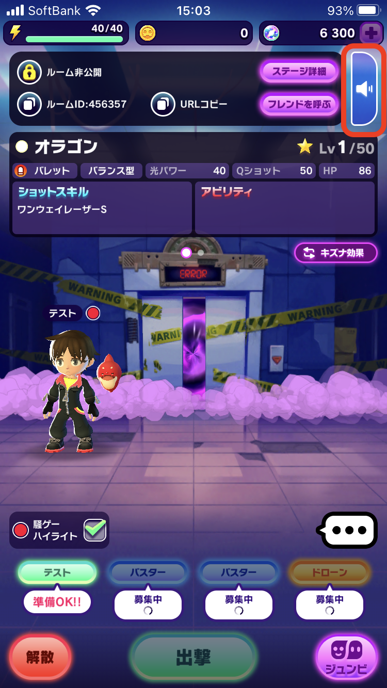
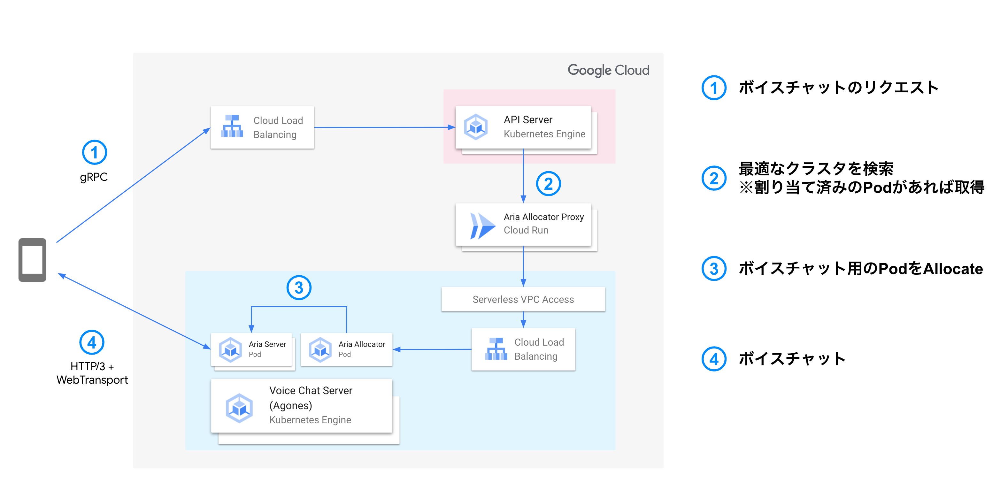
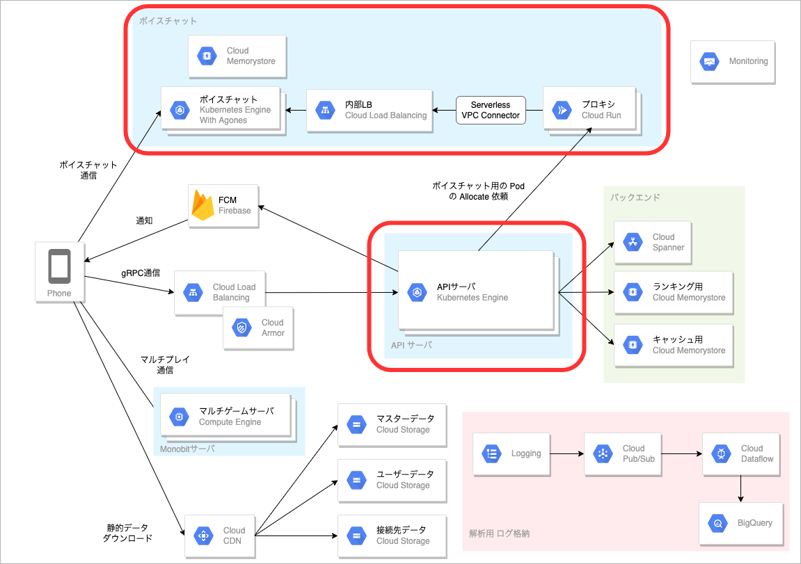

# title

こんにちは。ミクシィの 開発本部 SREグループ の [riddle](https://twitter.com/riddle_tec) です。

https://youtu.be/kNGOW8RcBbA

私はゴーストスクランブルというスマホゲームを開発しています。

> ゴーストスクランブル（以下、ストブルと略します）は、弊社のモンストシリーズ最新作として2022年7月にリリースされたスマホゲームです。マルチプレイとボイスチャット機能を搭載していて、最大4人でマルチプレイができます。
>
> [ゴーストスクランブル（ストブル）公式サイト](https://ghost-scramble.com/)

ストブルは GCP を使って以下の構成で動かしています。

※詳しくは [スマホゲームのゴーストスクランブルの裏側を支える技術](https://mixi-developers.mixi.co.jp/stble-over-view-ab9bc69f5819) をご覧ください

  

---

今回はストブルにおける「**ボイスチャットの仕組み**」を紹介します。

※音声パケットルーティングに関する話やクライアント側の実装は扱わず、サーバ構成や Agones の話を紹介します。

扱うのはこの範囲です！
  

# ボイスチャットについて

ストブルはマルチプレイができるアクションゲームで、一緒に遊んでる人とボイスチャット(以下ボイチャと略す)ができます。

  
※スピーカーボタンを押すとボイチャができる

裏側ではユーザ間で音声交換をするアプリが GKE 上の Pod で動いています。(以後この Pod をボイチャルームと呼ぶ)

ボイチャルームは音声交換をするため **「このボイチャルームには誰が接続できるのか？」** や **「ゲーム終了後には不要になるので削除する」** など API サーバや Web サーバとは違う性質を持っています。そのためボイチャルームを Kubernetes(以下 k8s と略す) の標準のリソース(Deployment / StatefulSet) で扱うことが非常に難しいです。

しかし k8s の**可用性や拡張性を運用者があまり考えなくて良い仕組みは魅力的** なので、どうにかこれらを組み合わせていい感じに運用したいです。

そこで使われる考え方として *Dedicated Game Server* (以下 DGS と略す) があります。詳しい説明は以下のサイトをご覧ください。

> 世界中で配信され、オンラインで同時プレイされるような、大人数で動きの速いマルチプレイゲームでは、多くの場合ゲームの世界を可能な限りリアルタイムに近い速度でシミュレートするために、プレイヤーが接続する専用ゲームサーバーが必要です。この専用ゲームサーバーを「Dedicated Game Server（以下、DGS）」と呼び、DGSはプレイヤーのステート（状態）を管理する役割を果たします。

> [AgonesとGame Serversを使ってKubernetes上でリアルタイム マルチ対戦ゲーム環境（DGS）を構築する方法](https://ascii.jp/elem/000/004/062/4062051/) より引用

DGS を自前で実装しようとすると大変ですが、Agones を使用すると DGS が手軽に実現できます。
# Agones とは？

Agones は Ubisoft と Google が共同開発している OSSで、k8s 上で動かすアプリケーションです。Agones を使うと k8s にカスタムリソースを追加でき、以下のような DGS に必須の仕組みを手軽に実現できます。

- Pod ごとに異なる接続先を持つ
- 利用状況に応じた Pod 数の維持
- ゲーム中かどうかを表現

Agones 周りの解説はこちらの記事がとても詳しいので詳しく知りたい方はご覧ください。

- [AgonesとGame Serversを使ってKubernetes上でリアルタイム マルチ対戦ゲーム環境（DGS）を構築する方法](https://ascii.jp/elem/000/004/062/4062051/)
- [Agones 超入門. この記事は Google Cloud Japan Customer… | by Yutty Kawahara | google-cloud-jp | Medium](https://medium.com/google-cloud-jp/agones-beginner-jp-5a6553e7e9a4)

# ストブルにおける Agones + GKE の設計

## ゲーム上での動き

ストブルにおけるボイチャルームが立つまでのユーザの操作を紹介します。

右上のスピーカーマークを押すとボイチャが始まります。(ただし自分しかいないので誰とも会話できない)

  

以降、ほかの人がスピーカーボタンを押せば会話ができるようになります。

## スピーカーマークを押した裏側の話

スピーカーマークを押すと、APIサーバへリクエストが飛んでいます。(図の①です)

  

APIサーバは CloudRun で動く Allocator Proxy を通じて **ボイチャルーム生成リクエスト** を送ります。その後 Voice Chat Server 上のアプリがボイチャルーム用の Pod を用意し、接続情報を API サーバ経由でクライアントに返却します。

クライアントは受け取った接続情報を使ってボイチャルームに接続します。この工程を複数のユーザが行うことで同じボイチャルームに入り通話ができます。（2番目以降にスピーカーマークを押すと、すでにボイチャルームがあるので同じ接続情報が返却されます）

## ボイチャルームが用意されるまでの詳細なフロー

ボイチャルームがどのように作られているのかを紹介します。まずは、いくつか独自コンポーネントを紹介します。

- Aria Allocator Proxy (Cloud Run)
   - API サーバからリクエストしてを受け付けるエンドポイントです。リクエストパラメーターに応じてバランシングを行い、街頭の GKE クラスター上の Aria Allocator にリクエストを投げます。
- Aria Allocator (GKE)
   - リクエストパラメーターに応じたボイチャルームが存在するかを Agones に確認し、存在した場合は接続情報を返し、存在しなかった場合は新しいボイチャルームを確保し接続情報を返します。
   - リクエスト処理時は同期を取るため、Redis で分散ロックを取得します。
- AriaServer (GKE)
  - ボイチルームとなる QUIC の通信サーバです(Elixir + Rust)

---

  

1. Aria Allocator Proxy では、受信したリクエストのパラメーターのハッシュを取得しどの GKE にリクエストを飛ばすかをハンドリングし、該当の GKE 上の Aria Allocator に通信を行います。
2. Aria Allocator はボイチャルーム(Aria Server)を検索・作成します。
   1. 既存のボイチャルームがなければ、起動済みの Aria Server Pod(Agones に管理される GameServer) を確保し、接続情報を返します。(Agonesを通じて確保する)
   2. ボイチャルームが存在する場合は接続情報のみを返します
3. 以降はクライアントが接続情報を使って Aria Server に接続します

# インフラの設計について

ボイチャのインフラを構成するにあたり、以下の点に注意しています。

- セキュリティ
  - ボイチャルームは Public IP を使うのでインターネットに直面しているが、API サーバはPrivate GKE Cluster で動いているのでネットワークを分離しておきたい
- スケーラビリティ
  - GKE で起動できる Pod 数がスケール上限になるので、複数の GKE が使えるようにする
- アップグレード、メンテナンス
  - ユーザ影響が出にくい方法にする

時差氏には VPC を分けて運用しています。（GCP プロジェクトは同一です)
  

## 独自プロキシと GKE を結ぶネットワーク

  

②のAPI サーバから Aria Allocator Proxy(Cloud Run) を呼び出す経路はインターネット経由です。API サーバの IP アドレスの固定は Cloud NAT で実現できますが、より安全にする意味で境界防御ではなく Cloud Run を invoke する権限を API サーバに付与しています。（Aria Allocator Proxy への [Google 署名付き ID トークン]((https://cloud.google.com/run/docs/authenticating/service-to-service?hl=ja))を発行して使っています）

続いて③です。Aria Allocator Proxy(Cloud Run) から GKE 上の Aria Allocator Service にアクセスする必要がありますが、Aria Allocator は GameServer を管理するコンポーネントであり Public IP をもたないため通信できません。そこで [Serverless VPC Access](https://cloud.google.com/vpc/docs/serverless-vpc-access?hl=ja) を使って Cloud Run から VPC にアクセスしています。

※Serverless VPC Access は[コネクタインスタンス](https://cloud.google.com/vpc/docs/serverless-vpc-access?hl=ja#scaling)というマネージドサーバで動作します。サーバにはマシンタイプがありタイプに応じてスループットが決まっています。最小と最大を決めるとオートスケールしますが、スケールインができないので注意してください

加えて Aria Server Service を `Type: LoadBalancer` で起動し、あらかじめ作成しておいた固定 IP を LoadBalancer に付与して、Aria Allocator Proxy(Cloud Run) から GKE 上の Aria Allocator Service への通信を実現しています。LoadBalancer は GKE 上の Aria Allocator ごとに1つ必要となるので、GKE クラスターが増えるたびに作成されます。

## マルチクラスターのための独自プロキシー

複数の GKE を使えるようにするためには **「適切な GKE クラスターにバランシングをする仕組み」** が必要になります。弊社ではこれを GKE とは別レイヤーで実現するために Cloud Run で独自のプロキシー（Aria Allocator Proxy)を動かしています。

Aria Allocator Proxy は `ALLOCATOR_HOSTS` という起動おあらメータでバランシング対象の Aria Allocator Service の IP(`type:LoadBalancer`の IP)を持ち、リクエストパラメーターのハッシュ値にでリクエストのバランシングを行います。ただし同じマッチングルームに存在するユーザを同じボイチャルームを案内したいので(API サーバによって同じリクエストパラメーターが付与されている)、 [Consistent Hashing](https://ja.wikipedia.org/wiki/%E3%82%B3%E3%83%B3%E3%82%B7%E3%82%B9%E3%83%86%E3%83%B3%E3%83%88%E3%83%8F%E3%83%83%E3%82%B7%E3%83%A5%E6%B3%95) を用いて常に同じ GKE へ分散できるようにしています。

また、メンテナンスやクラスターの増減を簡易に行えるように **「以前登録していた GKE」** を示す `ALLOCATOR_OLDHOSTS` を Cloud Run に設定しています。このパラメーターがどのように作用しているのか、GKE クラスター A と B がある状態で C を新規追加する例を考えます。

1. GKE クラスター C を準備する
2. `ALLOCATOR_HOSTS=A,B,C`、`ALLOCATOR_OLDHOSTS=A,B` を Aria Allocator Proxy に設定し再起動する
3. Aria Allocator Proxy がボイチャルーム作成リクエスト受け付けると最初に`ALLOCATOR_OLDHOSTS` の GKE クラスター内から既存のボイチャルームを検索し、存在すればそれを返す
4. 存在しない場合は `ALLOCATOR_HOSTS=A,B,C` のいずれかに対して Consistent Hashing でクラスターを選択しボイチャルームの作成を依頼する

`ALLOCATOR_HOSTS=C` とすれば以後は C にしかボイチャルームが作成されないので、一定時間経ってボイチャが終了すれば A と B クラスターを安全に削除できます。

# まとめ

今回はストブルで利用しているボイスチャット周りの独自実装とインフラ構成をご紹介しました！
Agones は非常に便利ですがマルチクラスター構成を考えたり、独自の動きがいくつかあるので利用には一定のハードルがあります。

今回は割愛しましたが実際にボイスチャットを実現している Aria Server の中身や、クライアントライブラリ側はまた別の機会にご紹介とさせてください。

# おまけ: Agones の設定の Tips

Agones を動かすにあたっていくつか気をつけたパラメーターについて紹介します。

## [CustomFasSyncInterval](https://github.com/googleforgames/agones/issues/1955)

Fleet AutoScaler が同期間隔のデフォルト値が30秒ですが、より高頻度でチェックしたいので有効化しています。

## [StateAllocationFilter](https://github.com/googleforgames/agones/issues/1239)

`GameServerAllocation` API は State が `Ready` な GameServer のみを返しますが、ボイチャでは Allocated な GameServer に後から参加させるシチュエーションがあるのでこの機能を有効化し、`Allocated` な GameServer も取得できるようにしています。

## [NodeExternalDNS](https://www.slideshare.net/NaoyaKishimoto/cedec-2021)

GameServer は IPv4 で Listen している一方で、接続元の iOS アプリは仕様により IPv6 で接続してきます。

これを解消するため NAT64 / DNS64 を使い IPv6 -> IPv4 に変換したアクセスを行う必要があるのですが、Agones は通常 GameServer の IP アドレス(IPv4)とポート番号を接続情報として返却するので iOS アプリは通信できません。
この機能を有効化すると接続情報が FQDN で返却されるので、iOS アプリは NAT64 / DNS64 により擬似 IPv6 で Aria Server に接続してボイスチャットができます。

## Fleet の replicas パラメーターと Fleet AutoScaler

Fleet AutoScaler と Fleet の replicas が設定されている状態で manifest を apply すると、 Fleet の replicas にしたがって一度 Gameserver が削除され、再び FleetAutoscaler が replica 数を増やすので意図しない挙動になります。

そのため、Fleet AutoScaler を使用する場合は Fleet の replicas 設定を削除しましょう。
