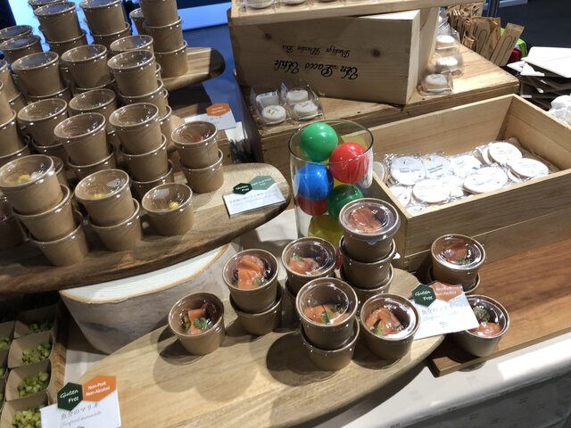

# title

こんにちは。MIXI 開発本部 SREグループの [riddle](https://twitter.com/riddle_tec) です。

先日、Google Cloud Next '22 で行われた **「第 2 回 Game Engineers Meetup」** に登壇しました。

> Game Engineers Meetup は Google Cloud のサービスから Agones や Open Match といった Gaming OSS まで、ナレッジやユースケースの共有と、ユーザー同士の交流を目的にした Meetup です。

https://youtu.be/NGME7f6F50g

大きいイベントに出させていただき貴重な経験ができたので、経緯や準備したことなどを紹介します！

# イベントに登壇する経緯

私の所属するチームでは Google Cloud の方にレビューやコンサルティングをお願いしています。
そのため、設計を共有している関係で我々が使っていた GKE + Agones が今回のイベントにピッタリだったので登壇の依頼をいただきました。

※出てくれませんか〜ぐらいのノリで来る
# 開催までにやったこと

登壇時のプレゼン資料を作成しました。
Google Cloud のイベントなので、向こうからいただいたテンプレートを使って資料を作っただけなので簡単でした。

↓実際に作った資料
  

ただ忘れちゃいけないのが **「社内の広報や知財のGoサインをいただくこと！」**
社外に出すのは色々気にしないといけないので大変ですね。

また今回はパネルディスカッションで合計4人(司会者を除く)で会話する形式だったので、質問したいことを事前に共有しておき当日あたふたしないようにしました。

## ついでに詳細な記事も書いた

何人かでパネルトークをする関係上「あまり説明の時間が取れない」とのことだったので、発表を補足する記事もあわせて書き上げて当日投稿できるようにしました。

https://mixi-developers.mixi.co.jp/stble-voicechat-with-agones-aec5cbebe4a4

記事を事前に書くと **「発表の時に説明したいこと」** や **「疑問点」** が色々と出てきますし、**「この順番で話せばいいな」** が何となく見えてくるのでオススメです！

# リハーサル

  

大きいイベントというだけあってリハーサルがちゃんとあります！すごい！

当日と同じように会場が設営され、進行の方や映像配信の方と一緒に当日の流れを確認していきます。

  

ここで分単位の細かいスケジュールや、動線の確認、椅子の位置、後日の録画配信を考慮した立ち位置などプロフェッショナルの仕事をみました。

イベントの裏側って色々あって大変なんだなあ・・・と実感。

## アメニティをもらう

「登壇時に着用してください」とTシャツをいただき

  

よくあるシールももらいました。

  

イベント中は Mac のりんごマーク見えると **NG** ってことで、いただいたシールを貼るようにと言われたので貼ってます。

  

またご時世ということで、当日に実施するコロナの抗原検査キットもいただきたイベント当日に確認しました。

  

# 開催当日

登壇の1時間ぐらい前に集合と言われていたので、受付をしてイベントの控室で待機していました。

  

イベントには軽食や昼食もついていましたね（豪華）。

  

  

そんなこんなでイベント開始です。

https://youtu.be/NGME7f6F50g

イベント開催タイミングに記事を Twitter で投稿してもらいました。
https://twitter.com/mixi_engineers/status/1580801072972505088?s=20&t=6SjefsPsYCBxa6XDHNroQg

# 打ち上げ

イベント終了後は Google 側で用意してくれたアフターパーティに参加しました。結

  
  
  

構色々出してくれたので、これをいただきつつ登壇者と GKE + Agones 周りや、Google Cloud 周りの最近の話や情報交換をしていました。

# 最後に

イベント登壇を通じてわかったのは、オフラインイベントだと交流会を通じて他社の事情や違い、流行をを知れるのがいいですね。

今までたくさんのイベントに参加してきましたが、発表を聞くだけでその後の打ち上げで有意義な話をした経験がなかったので、今回のイベントはとても刺激になりました。

イベントの準備・参加はそれなりに大変でしたが、(他のテーマでも)ぜひ参加していきたいなと思いました。
