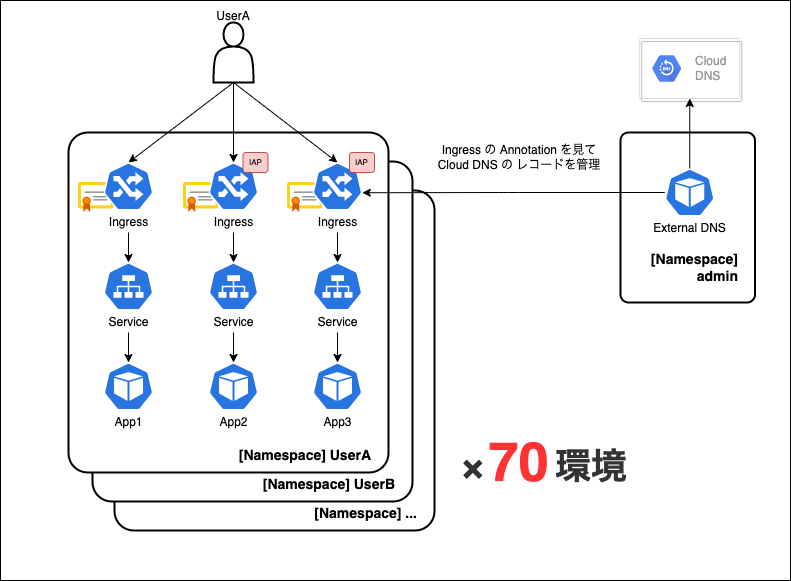
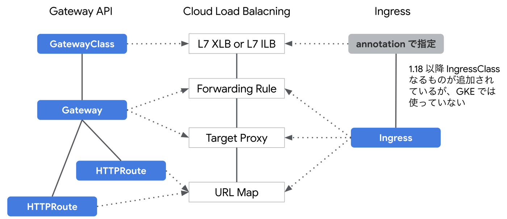
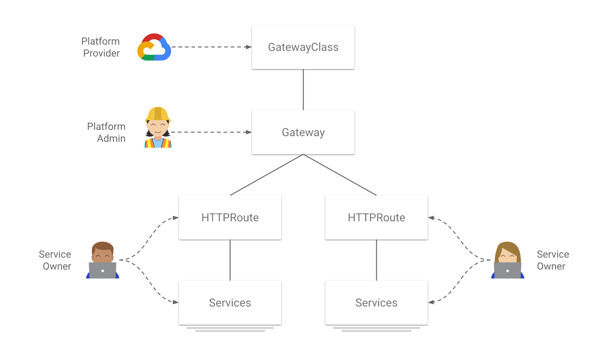
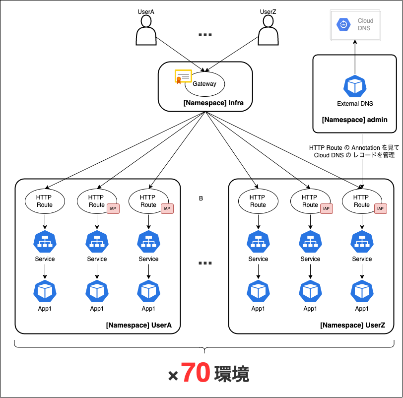

# 開発環境で Ingress 200個使ってたら構築に3時間かかるようになったので Gateway API に乗り換えてみたけどまだ早かった話

こんにちは。MIXI 開発本部 SREグループの [riddle](https://twitter.com/riddle_tec) です。

開発環境で Ingress から Gateway API に移行しようとアレコレしたけど、機能が一部足りない(Identity-Aware Proxy がない)ので諦めた話を紹介します。

※機能が追加されたら再チャレンジするんだ…

## 目次

# 開発環境の話

わたしたちは開発環境に GKE を利用しています。

ゲーム開発では、エンジニアだけではなくプランナーやデザイナーも個人環境がある方が仕事が進めやすいため、GKE 上に各自の Namespace / Ingress / 証明書(Managed Certificate) / Pod を作成しています。

現状はこんな感じ。


手軽に環境が作れるため、現在は Ingress や証明書が **約 200 個** もあります。

※DNS レコードの発行は external-dns にお任せしています
※一部のアプリは Identity-Aware Proxy(IAP)を使っています

# 開発環境の問題点

仮想マシンと違ってコンテナ環境は手軽に作れるためたくさん環境を作っていたのですが、最近環境の作成に時間がかかるようになってきました。
以前は一番時間がかかるのが **「Ingress で作られた IP アドレスを Cloud DNS に登録し証明書を発行してもらうプロセス」** で**約1時間**だったのですが、今は **3時間**もかかっています。

調べたところ、新しく環境を作ると Ingress は存在するのに、いつまでたっても HTTPS LB が作られないことに気づきました。

Google サポートに問い合わせたところ **「Ingress Controller の仕様でプロジェクトに存在している Ingress の数 x 1分 だけ LB の作成、更新に時間がかかる」** と回答いただきました。(より詳細には「APIへのリクエストの処理が各ingress毎に相当の回数が必要で、キューに溜まっているリクエストを順次処理する仕組みのため」とのこと)

- [Improve provisioning latency for ingress [171572578] - Visible to Public - Issue Tracker](https://issuetracker.google.com/issues/171572578)

つまり **201 個目** の Ingress を作成すると、HTTPS LB の作成までに **201 分(3時間超)** かかリマス。実際は、LB の作成が終わって IP アドレスが払い出されてから、さらに証明書発行で **1時間** かかるため、合計で環境作成に **4時間超** もかかってしまいます。

流石にこれは遅すぎるのでどうにかしたいですね。

# いくつかの解決策

1. 個人環境数を減らす
2. Ingress を減らす (1 Namespace に 1 Ingress にする)
3. Ingress を減らす (全員同じ Namespace にして Ingress を 1 つにする)
4. リバースプロキシを立てて、URLごとに振り分ける

1 の「個人環境数を減らす」はインフラ都合で開発の効率を落とすのでよろしくないですね。
2 の「1 Namespace に 1 Ingress にする」はできるけど、環境数増えると再発します。
3 の「全員同じ Namespace にして Ingress を 1 つにする」は Namespace を気軽に消せなかったり、リソース名のバッティングを今から考えるのが大変です。
4 の「リバースプロキシを立てて、URLごとに振り分ける」は本番環境と構成が変わりすぎるのでタイムアウトや、性能劣化に気づけない恐れがあります

ということであまりいい解決策がなく悶々としていました。

しかしある日ネットサーフィンをしていたところ Gateway API という、 Ingress の次の技術が出てきていてそれがユースケースにジャストフィットしていることに気づきました。これだ！！！

https://twitter.com/kkuchima/status/1550695697372311554?s=20&t=sS0jhqZiuLQMhKOtda4-TQ

# Gateway API とは?

Ingress で実現したことが多すぎるので、より細かく LB 周りのリソースを使えるようにした Kubernetes リソースです。

GKE における Ingress では作成時にフォワーディングルールをきめたり、バックエンドの設定をしたり、IPアドレス、証明書、パス など様々な設定をしていました。

しかしこの図を見ていただくと、Gateway API では Google LB の各コンポーネントに対して別の Kubernetes Resource が割り当てられています。
  
https://medium.com/google-cloud-jp/gke-gateway-4150649d8c37 より引用

これにより Platform Admin(いわゆるインフラ担当)が LB や証明書を管理しつつ、どのパスのときにどの Pod に通信させるのか？を各サービスオーナー(いわゆる開発者)を別々に管理することができます。

  


Gateway API について詳しく紹介してくれているブログがあるので詳細はこちらをご覧ください。
- [Ingress の進化版 Gateway API を解説する Part 1 (シングルクラスタ編) | by Kazuu | google-cloud-jp | Medium](https://medium.com/google-cloud-jp/gke-gateway-4150649d8c37)
- [動作検証しながら理解する「Kubernetes Gateway API」と「GKE Gateway Controller」 - ZOZO TECH BLOG](https://techblog.zozo.com/entry/gke-controller-verification#%E5%88%A9%E7%82%B91%E3%83%AB%E3%83%BC%E3%83%86%E3%82%A3%E3%83%B3%E3%82%B0%E3%81%AE%E8%A8%AD%E5%AE%9A%E3%81%AB%E5%BF%85%E8%A6%81%E6%9C%80%E5%B0%8F%E9%99%90%E3%81%AA%E6%A8%A9%E9%99%90%E3%82%92RBAC%E3%81%A7%E4%BB%98%E4%B8%8E%E3%81%A7%E3%81%8D%E3%82%8B)

---

Gateway API を使うと何が嬉しいのかというと、Gateway を 1つとワイルドカード証明書を1個作れば、リクエストをどの Pod に飛ばすルールを Namespace ごとに書けば、Pod を外部に公開できるところです。

Ingress を **200 個** も作らなくて済むし、今後環境が増えても LB や証明書が増えることがないんです！！

 

しかも Google Cloud に [Certificate Manager](https://cloud.google.com/certificate-manager/docs/overview) というワイルドカード証明書が簡単に作れるサービスがいつの間にか登場している！

波に乗るしかないですね。

# Ingress から Gateway API に移行してみた(けどダメだったので未実施)

冒頭に書いた通り 2022/10/13 において Gateway API では IAP が非対応のため導入には至っていません。

ただそれに気づくまでに考えたことや、ぶつかったことがいくつかあるのでそれを紹介します。

## 検討した移行方式

今回私たちは
- Before: Ingress + Managed Certificate
- After : Gateway API + Certificate Manager

に引っ越す予定でした。

Ingress から Gateway API の移行ですが、この2つはそれぞれ IP アドレスを発行するので共存が可能です。

そのため後は **「いつ切り替えるのか？」** を考えるだけOKです。

Gateway API で発行された IP アドレスを Ingress で使用している FQDN に紐付ければ、Gateway API でも Ingress 経由の両方で同じアプリに通信することができます。（ただし提示される証明書が異なる点には注意してください

その後は、Ingress の IP アドレスを A レコードから取り除くことで、Gateway API のみアクセスできるようになります。（ただし DNS レコードの TTL によっては、長期間クライアントに DNS キャッシュが保持されている点に注意してください）

## Gateway API 導入の注意点

Gateway API にはいくつか制限があります。

詳細はこちら。

- [プレビューの制限と既知の問題  |  Kubernetes Engine ドキュメント  |  Google Cloud](https://cloud.google.com/kubernetes-engine/docs/how-to/deploying-gateways?hl=ja#limitations)

幸い自分たちは問題ありませんでしたが、コンソール上で見れないのはいざという時困りそうです。

> 現在、Gateway によって作成された Google Cloud ロードバランサのリソースは、Google Cloud Console UI には表示されません。


## External DNS がまだ Gateway API の beta に未対応

厳密にいうと master ブランチには PR がマージされてますが、まだパッケージとしては未リリースという状態です。(コミット指定でビルドすれば良いのですが、あんまり急いでないので保留)

しばらく待ちましょう。

- [gateway-api: upgrade from v0.4.3 to v0.5.0 by abursavich · Pull Request #2881 · kubernetes-sigs/external-dns](https://github.com/kubernetes-sigs/external-dns/pull/2881?w=1)

## URLMap の 64KB 制限

[割り当てと上限 | 負荷分散](https://cloud.google.com/load-balancing/docs/quotas?hl=ja)を見ると気になる制限に「URLマップのサイズが **64KB**」とあります。

自分達の環境で試してみたところ、おおよそ 1個人環境(=3 HTTP Route)作成すると **3KB** 使うことがわかりました。

※この値は追加するルールによっていくらでも変わるため、実際に導入する際は以下のコマンドを使ってみて `HTTP Route` の作成前後を比較してみてください。

```
gcloud compute url-maps describe [URL_MAP_NAME] --global
```

1 Gateway に用意できる環境数は **64KB / 3KB = 21環境** のため複数の Gateway をあらかじめ用意しておく必要がありそうです。また HTTP Route をどの Gateway に紐づけるかですが、ロジックを書くようなことはできないので、Helm や kustomize でパラメータを動的に配置する際に外部から指定させます。

具体的には、Helm + CloudBuild で manifest の生成をおこなっているので、生成のタイミングに各 Gateway への HTTP Route のアタッチ数を見て、一番少ないところを選んで Helm Values に渡す予定です。

# まとめ

IAP が導入されるのを待ちつつ、きっとその頃には External DNS もリリースされ、Gateway API も Google Cloud の正式サービスとして利用できるようになると思うのでしばらく寝かせます！！！

とりあえず環境構築4時間かかるのは、環境を減らすので緩和していきたい。
