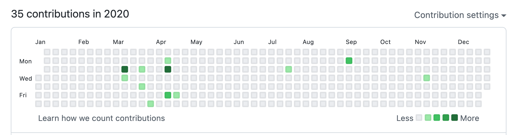
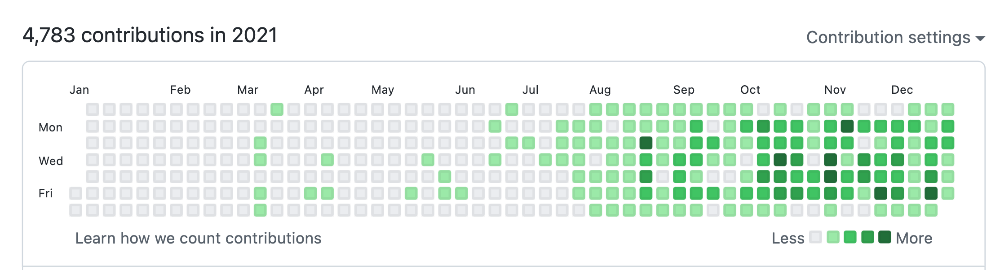
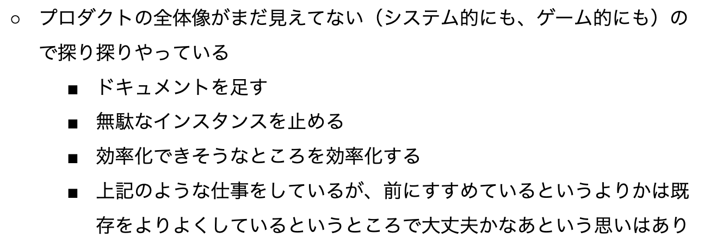
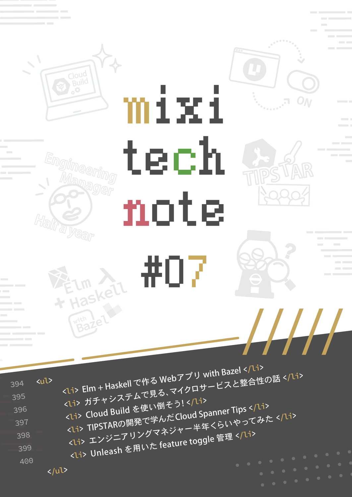
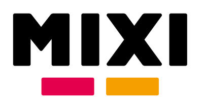

# 恥を忍んで転職して大変だったキャッチアップ事情を書いてみる

こんにちはMIXI 開発本部 SREグループ の [riddle](https://twitter.com/riddle_tec) です

今回は転職して感じた **「周りについていくのが大変！」** という思いについて、謙遜では？と思われる方のために実体験を踏まえながら紹介したいと思います。

どこのブログをみてもキラキラしていて、転職するのに勇気が出ないそんなあなたの一助になれば幸いです。

### 目次

## どんなチームに入ったのか？

私が入ったのは新作ゲームを作るサーバチームでした。担当領域としては Go を利用したサーバサイド開発と、それが動く Google Cloud (主に GKE) の設計・構築です。

自分のキャリアは SIer ではじまり、主にインフラ技術を中心として歩んできたので、配属先のチームで使われていたいくつかの要素は完全にはじめてでした。

- アプリケーション開発
- GitHub ベースの開発
- CI / CD
- Go
- Google Cloud

また、これまでは 要件定義 -> 設計書 -> インフラ設定 -> テスト -> リリース という工程で仕事をすすめていたため、ドキュメント類が無くコードを読んで全容を把握する仕事の進め方や、その場で「こうすべき！」を勝手に決めて（もちろん相談しますが）進んでいく仕事のやり方は**異世界**でした。

仕事内容は完全にコンフォートゾーン(自分にとって心地の良い環境)から外れていましたね。

また上記の他にもほとんど知らないツールや技術が大量にあり、逆にわかるところのほうが少なかったことを覚えています。(幸い Kubernetes はわかったのでよかった)

- Asdf
- Bazel
- Helm
- Kpt
- gRPC
- etc...

## はじめての仕事

入社の翌日から取り掛かった仕事は **「Go アプリにハードコーディングされたクレデンシャルを Google Cloud の SecretManager に格納し、GKE 上の External Secret から取得して Pod に渡す」** というものでした。

いまやるとすぐ終わるタスクなのですが(環境があれば 30 分ぐらい？)、当時はタスクを終えるのに**1週間近くかかった**記憶があります。

- 開発環境を整える
- Go のアプリに手を入れる
- テストコードを書く
- Bazel を使ってビルド＆テストする
- Terraform で Google Cloud を操作する
- Kubernetes Manifest で External Secret の設定を追加する
- 実際にアプリをデプロイする

やっているタスクが **「簡単なレベル」** ということはわかっていたので、思うように進まないことに**精神ダメージを食らった記憶**があります。(周囲のサポートがなかったわけではなく、単純にいままでやってたことのギャップが広い)

GitHub のコミットをみてみるとどこで転職したのか一目瞭然ですね。
※とろこどころあるコミットは転職のときのコーディング試験系

## 1ヶ月ぐらいたった時の悩み

時は流れはや1ヶ月。

そろそろ仕事に慣れてきたかな？？？？

たしかになんとなく慣れました。しかし**タスクをきちんとこなせるか？と言われると別です。**

弊社では毎週、上長と 1on1 ミーティングをして自由に色々話すのですが、その時に自分が書いていた文章がこちら。

**「今の自分にできることを探して、とりあえずなんかやる」** ことしか出来なかったので、クリティカルなタスクではなくとにかく学びをえたり、何かで貢献するためにアクションを起こしていました。

たとえばこんな感じ。

- 読んだコードに対してコメントを追加する
- インフラの構成を理解を兼ねて図に起こす
- ムダなところを改善してみる

転職するとある程度の待遇や評価で入社するので **「やってることが求められていることに見合ってないなあ」**と日増しに感じていた記憶があります。（いまでもあるけど）

それに加えて焦りを加速させるのは **「周りのレベルの高さ」** です。自分が担当するよりも難しいタスクをいくつもこなし、的確なレビューを幅広い技術領域に対して行っているメンバーの姿を見るとひたすらに萎縮します。

**「他の人と比べる必要はない…」と頭ではわかっても気持ちはついてきません。**

## 3ヶ月ぐらいたって

これぐらい立つと環境の理解もだいぶ進み、技術的にも慣れてくるので **「皆が気づいていない問題点を見つけ出して、それを改修する」** とか **「新しい試みを導入する」** ということができるようになった気がします。

私の場合はプロジェクトにこれらのツールを入れるところを最はじから最後まで担当できたため、プロジェクトの中でも得意分野が少しづづ増えてきました。

- [ArgoCD](https://argo-cd.readthedocs.io/en/stable/) の導入
- [Monobit](https://www.monobitengine.com/mun/) の導入

また、新しいものを導入するにあたりなるべく手厚く README や Pull Request にコメントを追加することで、自分自身の理解度を高めつつ作業を行うようにしました。

## 半年ぐらいたって

半年ぐらい経つと現場にもだいぶ慣れ、**そこで培ったことを周りに展開する余裕もでてきました。** これらは実際にプロジェクトで色々と悩んで実装したことを記事にした内容です。

- [CloudBuild で最強のTerraform & Terragrunt CI環境を作る | mixi developers](https://mixi-developers.mixi.co.jp/strongest-terraform-terragrunt-ci-e4c350d627e6)
- [HelmのvaluesとChartが別リポジトリの時にArgoCDでデプロイする方法 | mixi developers](https://mixi-developers.mixi.co.jp/argocd-with-helm-7ec01a325acb)

社外向けに記事を書くのは人生ではじめてでしたが、最はじの1回をどうにかこなせれば徐々に慣れてきましたね。

2020年末には社内から声をかけていただき、関わることのないと思っていた同人誌の作成も [技術書典：技術書オンリーイベント](https://techbookfest.org/) で共同という形でしたがチャレンジすることができました。

 

簡単な内容はこちらの記事でも紹介しています。
- [Cloud Build Deep Dive | mixi developers](https://mixi-developers.mixi.co.jp/cloud-build-deep-dive-f2cd75e7ab91)

元々存在すら知らなかった `Google Cloud Build` をプロジェクトを通じて触って知った内容を色々詰め込んでいるので、もとからできていたわけではありません。

また、最近はプロジェクトで生み出された一部のツールを切り出して**OSS 化してメンテナンス**もします。(まさか自分が OSS を作ることになるとは)

- [lirlia/check-all-ci-completion-action](https://github.com/lirlia/check-all-ci-completion-action)
- [lirlia/github-comment-notifier-to-slack](https://github.com/lirlia/github-comment-notifier-to-slack)

## まとめ

転職してすぐは右も左もわからず、使うツールも知り合いもおらず四苦八苦していました。

ただ半年ほどいろんな活動を通じて、色々学んだり・教えてもらったりして一歩づつ積み重ねることで、少しづつコンフォートゾーンに近づいている感覚はあります。

最近は元々のプロジェクトを離れ、まったく違うジャンルの技術領域(ブロックチェーン)にチャレンジをはじめたので勉強の毎日なのは変わらないのですが、楽しくできています。

それもこれも、**自由に考えられる環境や向上心の強いチームメンバーが多いMIXI風土と文化**によるものだと思っているので、少しでも興味がわきましたらぜひカジュアル面談からお待ちしております！

- [中途募集職種 – mixi GROUP RECRUIT](https://mixigroup-recruit.mixi.co.jp/jobs/?cats=career,engineer&tags=)　こちらからどうぞ！
