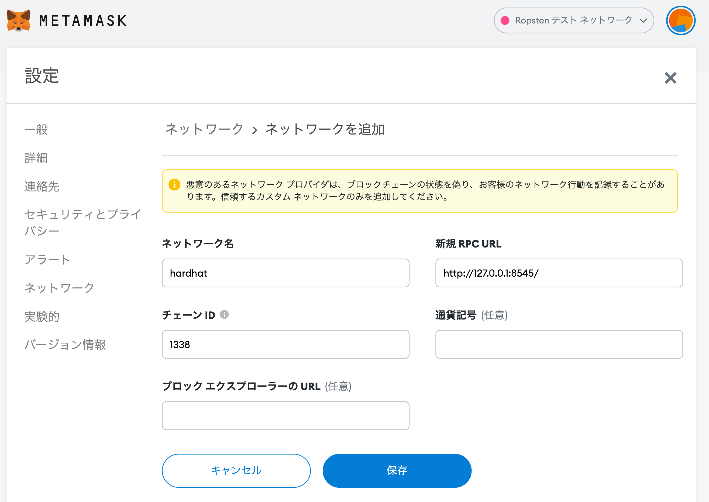
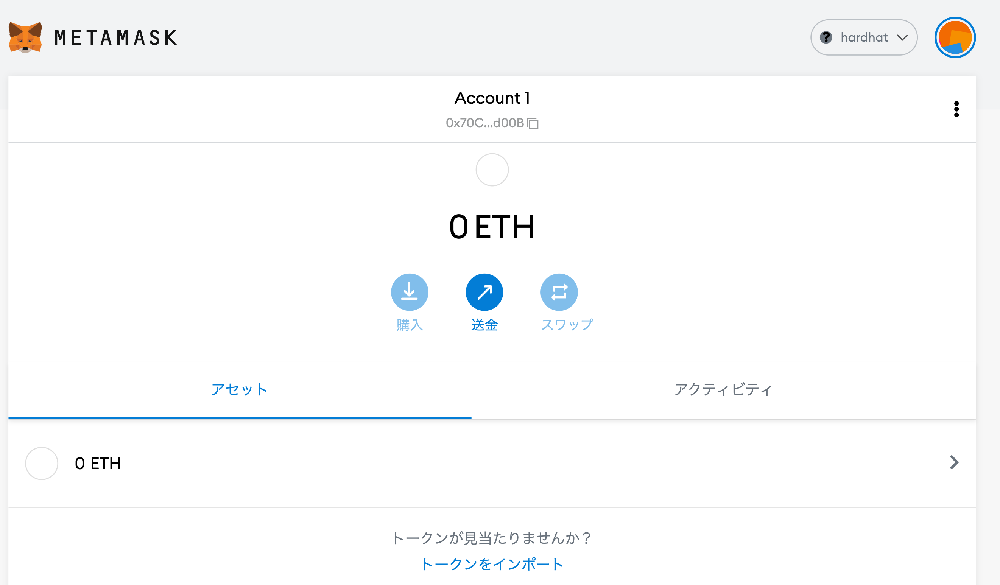
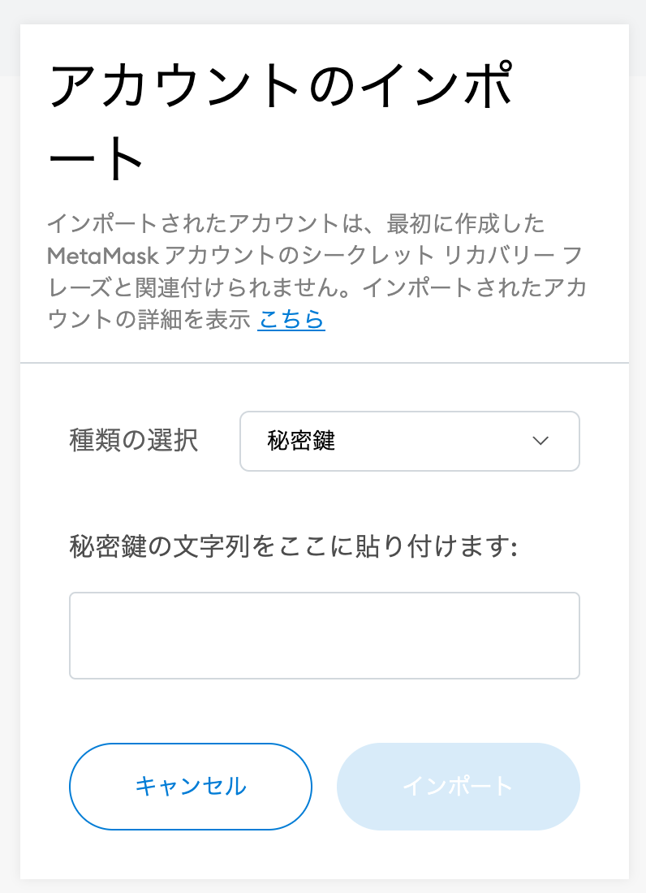
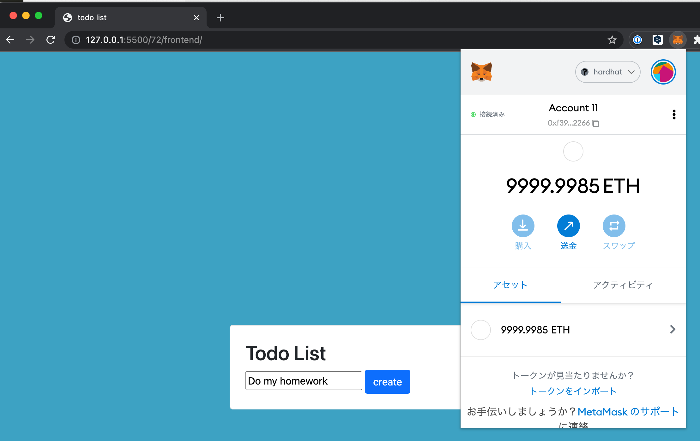

# DApps を Hardhat に移行してみた


こんにちはミクシィの 開発本部 SREグループ の [riddle](https://twitter.com/riddle_tec) です。

今回は、先日作った TODOリストの Dapps を HardHat を使って動かしたいと思います。(最近は `Hardhat` が結構使われているよと教えてもらった)

- 先日のやつ → [Dapps TODO リスト をSolidity で作ってみた](https://mixi-developers.mixi.co.jp/todo-dapps-5ae6b38f7da9)
- 今回のコードはこちら → [lirlia/solidity-hardhat-todo](https://github.com/lirlia/solidity-hardhat-todo)

### 目次

# Hardhat とは？

Hardhatは **Ethereum 6ソフトウェアをコンパイル、デプロイ、テスト、およびデバッグするための開発環境**です。

Truffle と異なり Hardhat 自体が Ethereum 互換のネットワーク(ローカルイーサリアムネットワーク)を構築できるため、Hardhat のみで Solidity で作ったスマートコントラクトのコンパイル・テスト・デプロイが可能です。

  

まだ使い始めたばかりで全容はわかっていませんが **migration ファイルを個別に作らなくても何度もスマートコントラクトがデプロイできる点**は便利ですね！

- [Overview | Hardhat | Ethereum development environment for professionals by Nomic Labs](https://hardhat.org/getting-started/)
- [NomicFoundation/hardhat: Hardhat is a development environment to compile, deploy, test, and debug your Ethereum software. Get Solidity stack traces & console.log.](https://github.com/NomicFoundation/hardhat)

# Hardhat に移行してみる

まずは `hardhat` をインストールしプロジェクトを作ります。

```sh
❯ npm install --save-dev hardhat
❯ npx hardhat run
888    888                      888 888               888
888    888                      888 888               888
888    888                      888 888               888
8888888888  8888b.  888d888 .d88888 88888b.   8888b.  888888
888    888     "88b 888P"  d88" 888 888 "88b     "88b 888
888    888 .d888888 888    888  888 888  888 .d888888 888
888    888 888  888 888    Y88b 888 888  888 888  888 Y88b.
888    888 "Y888888 888     "Y88888 888  888 "Y888888  "Y888

👷 Welcome to Hardhat v2.8.4 👷‍

👷 Welcome to Hardhat v2.8.4 👷‍

✔ What do you want to do? · Create a basic sample project

✔ Hardhat project root: · /Users/xxx/xxx

✔ Do you want to add a .gitignore? (Y/n) · y

✔ Do you want to install this sample project's dependencies with npm (hardhat @nomiclabs/hardhat-waffle ethereum-waffle chai @nomiclabs/hardhat-ethers ethers)? (Y/n) · y

...

✨ Project created ✨
```

ディレクトリ構成はこんな感じです。早速自作の TODO コントラクトを配置していきます。

```sh
❯ exa --tree --level=2 -I node_modules
.
├── contracts
│  └── Greeter.sol
├── hardhat.config.js
├── package-lock.json
├── package.json
├── README.md
├── scripts
│  └── sample-script.js
└── test
   └── sample-test.js
```

`contracts/Greeter.sol` に↓を貼り付け、名前を `contracts/todo.sol` に変更します。

```solidity
//SPDX-License-Identifier: Unlicense
pragma solidity ^0.8.0;

contract todo {

  struct Todo {
    string contents;
    bool is_opened;
    bool is_deleted;
  }

  Todo[] public todos;

  // id と address の紐付け
  mapping (uint => address) public todoToOwner;
  mapping (address => uint) todoCountByOwner;

  // 自分のものだけ作業できるようにする
  modifier onlyMine(uint id) {
    require(todoToOwner[id] == msg.sender);
    _;
  }

  // すべての TODO を返却する
  // 疑問: address を引数にとらなくてもよい？
  // -> address を指定して関数を呼べてしまうと他人のTODOが見れるので駄目
  function getTODO() external view returns(uint[] memory) {

    // TODO の数が 0 ならからの配列を返す
    if (todoCountByOwner[msg.sender] == 0) {
      uint[] memory emptyArray = new uint[](0);
      return emptyArray;
    }

    // array は memory か storage か設定しないと駄目
    uint[] memory result = new uint[](todoCountByOwner[msg.sender]);
    uint counter = 0;

    for (uint i = 0; i < todos.length; i++) {
      if (todoToOwner[i] == msg.sender && todos[i].is_deleted == false) {
        result[counter] = i;
        counter++;
      }
    }

    return result;
  }

  // 引数から TODO を作成し storage に保存する
  function createTODO(string memory _contents) public returns(uint) {
    todos.push(Todo(_contents, true, false));
    uint id = todos.length - 1;
    todoToOwner[id] = msg.sender;

    // TODO 数を増やす
    todoCountByOwner[msg.sender]++;

    return id;
  }

  function updateTODO(uint _id, bool _is_opened) public onlyMine(_id) {
    // 指定の id の TODO をアップデートする
    todos[_id].is_opened = _is_opened;
  }

  function deleteTODO(uint _id) public onlyMine(_id) {
    require(todos[_id].is_deleted == false);

    // 自分の TODO を削除する
    todos[_id].is_deleted = true;

    // TODO 数を減らす
    todoCountByOwner[msg.sender]--;
  }
}
```

続いてデプロイ用のスクリプトを修正します。

```js
// We require the Hardhat Runtime Environment explicitly here. This is optional
// but useful for running the script in a standalone fashion through `node <script>`.
//
// When running the script with `npx hardhat run <script>` you'll find the Hardhat
// Runtime Environment's members available in the global scope.
const hre = require("hardhat");

async function main() {
  // Hardhat always runs the compile task when running scripts with its command
  // line interface.
  //
  // If this script is run directly using `node` you may want to call compile
  // manually to make sure everything is compiled
  // await hre.run('compile');

  // We get the contract to deploy
  const Todo = await hre.ethers.getContractFactory("todo");
  const todo = await Todo.deploy();

  await todo.deployed();

  console.log("Todo deployed to:", todo.address);
}

// We recommend this pattern to be able to use async/await everywhere
// and properly handle errors.
main()
  .then(() => process.exit(0))
  .catch((error) => {
    console.error(error);
    process.exit(1);
  });
```

test は動作に関係ないので無視します。

ここまで来たら一度デプロイしてみましょう。

```sh
❯ npx hardhat compile
Compiling 1 file with 0.8.4
Solidity compilation finished successfully

❯ npx hardhat run scripts/sample-script.js
Todo deployed to: 0x5FbDB2315678afecb367f032d93F642f64180aa3
```

問題なさそうです。

ではローカルに起動した Hardhat Network へデプロイしてみましょう。まずは Metamask からこのネットワークを特定するために `hardhat.config.js` で `chainId` を指定します。(私は Ganache が `chainId: 1337` を使っているので修正していますが、特に使っていないのであれば `1337` で大丈夫です)

```js
require("@nomiclabs/hardhat-waffle");

module.exports = {
  solidity: "0.8.4",
  // https://hardhat.org/metamask-issue.html
  networks: {
    hardhat: {
      chainId: 1338
    },
  }
};
```

続いて別ターミナルを開き `network` を起動します。

```sh
❯ npx hardhat node
Started HTTP and WebSocket JSON-RPC server at http://127.0.0.1:8545/

Accounts
========

WARNING: These accounts, and their private keys, are publicly known.
Any funds sent to them on Mainnet or any other live network WILL BE LOST.

Account #0: 0xf39fd6e51aad88f6f4ce6ab8827279cfffb92266 (10000 ETH)
Private Key: 0xac0974bec39a17e36ba4a6b4d238ff944bacb478cbed5efcae784d7bf4f2ff80
```

ターミナルをもとに戻して、このネットワークにコントラクトをデプロイしましょう。

```sh
❯ npx hardhat run --network localhost scripts/sample-script.js
Todo deployed to: 0x5FbDB2315678afecb367f032d93F642f64180aa3
```

# MetaMask の準備

先程起動したネットワークを MetaMask から使いたいので設定を追加します。

  

  

続いて `npx hardhat run --network localhost scripts/sample-script.js` 実行時に表示された秘密鍵を使ってアカウントをインポートします。

```sh
Account #0: 0xf39fd6e51aad88f6f4ce6ab8827279cfffb92266 (10000 ETH)
Private Key: 0xac0974bec39a17e36ba4a6b4d238ff944bacb478cbed5efcae784d7bf4f2ff80
```

  

すると `ETH` を大量に持ったリッチなアカウントが表示されます。
  

# フロントエンドの準備

このリポジトリの `frontend` ディレクトリをまるごとコピーしてきます。
- [solidity-todo/frontend at main · lirlia/solidity-todo](https://github.com/lirlia/solidity-todo/tree/main/frontend)

そうしたら `frontend/contract.js` を開いて `contractAddress` の値をデプロイ時に出力されたアドレスに変更します。

```js
// Set contract address
const contractAddress = "0x5FbDB2315678afecb367f032d93F642f64180aa3"
```

続いて `frontend/main.js` で以下の変更を加えます。

```diff
- import todoContract from '../build/contracts/todo.json' assert { type: "json" };
+ import todoContract from '../artifacts/contracts/todo.sol/todo.json' assert { type: "json" };
```

```diff
- const web3 = new Web3(Web3.givenProvider || "http://localhost:7545");
+ const web3 = new Web3(Web3.givenProvider || "http://localhost:8545");
```

変更を加えたら VScode などを用いて起動してみましょう。

MetaMask がこのような状態になっていればOKです。

  

# 動かしてみる
そうしたらあとは動かすだけですね！(微妙に画面の内容が違いますが気にしないでください)


# まとめ

Truffle + Ganache の代わりに `Hardhat` を使ってみました。

導入含めてすごく簡単でしたし、テストやデプロイについても書きやすかったので(テストは今回紹介していないですが)今後は `Hardhat` をメインで使ってみたいと思います！

- [Overview | Hardhat | Ethereum development environment for professionals by Nomic Labs](https://hardhat.org/getting-started/)
- [NomicFoundation/hardhat: Hardhat is a development environment to compile, deploy, test, and debug your Ethereum software. Get Solidity stack traces & console.log.](https://github.com/NomicFoundation/hardhat)
