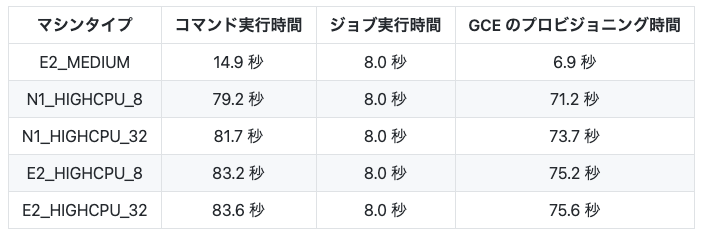

# Cloud Build のプロビジョニング時間がどれぐらい短縮されたのか調べてみる

こんにちはミクシィの 開発本部 SREグループ の [riddle](https://twitter.com/riddle_tec) です。

[Cloud Build の同人誌](https://speakerdeck.com/mixi_engineers/mixi-tech-note-number-07?slide=37)を出したのでそこそこ詳しくなりました。そんなCloud Build で **<span style="color: #e04b9e">「プロビジョニング時間が短くなる」</span>** という嬉しいアップデートがあったので **<span style="color: #e04b9e">どれぐらい短縮されたのか</span>** を調べてみます。

  

[Cloud Build release notes  |  Google Cloud](https://cloud.google.com/build/docs/release-notes)

# 最初に結論

ビルドが **<span style="color: #e04b9e">約30秒</span>** 早く始まるようになりました

※ただしマシンタイプを指定しないビルド(`E2_MEDIUM` 利用時)は除きます。`E2_MEDIUM`は元から高速(**<span style="color: #e04b9e">7秒</span>**)にビルドが始まります。

**<span style="color: #e04b9e">目次</span>**

# 以前のプロビジョニング時間
Cloud Build とは Google Cloud のフルマネージドな CI/CD サービスで、Google Compute Engine (GCE) 上で動いています。

  

詳しくはこの記事で解説しているのでご覧ください。

[Cloud Build Deep Dive | mixi developers | mixi developers](https://mixi-developers.mixi.co.jp/cloud-build-deep-dive-f2cd75e7ab91)

今回は Cloud Build の裏側の **<span style="color: #e04b9e">「GCE の起動時間 = プロビジョニング時間」</span>** がどの程度早くなったのか？をチェックします。

すでに昔の GCE にはアクセスできないため、2021/12/20頃に取得したデータと比較します。(一番右の数字がプロビジョニング時間で `E2_MEDIUM` 以外のマシンタイプでは **<span style="color: #e04b9e">70秒超</span>** かかっています)




一体どれぐらい短縮されるのでしょうか？

# プロビジョニング時間の計測方法

```yaml
steps:
  - name: bash
    args:
      - -c
      - echo
      - "hello"
```

`echo "hello"` を行うジョブでプロビジョニング時間を計測します。

計測対象のマシンタイプ一覧はこちら↓

  


[REST Resource: projects.builds  |  Cloud Build Documentation  |  Google Cloud](https://cloud.google.com/build/docs/api/reference/rest/v1/projects.builds#machinetype)

# プロビジョニング時間の計測結果

  

OS は Ubuntu から Debian に変わり、`UNSPECIFIED(E2_MEDIUM)` を除く N1 / E2 系のマシンタイプでは **<span style="color: #e04b9e">約30秒</span>** ほどプロビジョニングが高速になっていました。

※`UNSPECIFIED(E2_MEDIUM)` は元から高速(7秒)で起動するので変化はありませんでした

※GCE 内に格納されているコンテナイメージ(`gcloud`等)も Debian ベースに変更されていました

---

  

[Cloud Build release notes  |  Google Cloud](https://cloud.google.com/build/docs/release-notes)

また Google Cloud の Release Note では **<span style="color: #e04b9e">「e2-highcpu-8 or e2-highcpu-32 in the default pool.」のみが Debian 11 の対象</span>** ということでしたが、確認したところ **<span style="color: #e04b9e">すべての MachineType においてバージョンが Debian 11 になっていました</span>**。

→こちらは現在 (2022/03/07) Google Cloud に問い合わせ中です。

# まとめ

  

OS が Ubuntu → Debian に変わり、高速にプロビジョニングされるようになりました (約30秒の短縮)。**<span style="color: #e04b9e">プロビジョニング時間は課金対象ではないので利用料金は変わりません</span>** が、ビルドの待ち時間が減るのは嬉しいですね。

一方でローカルに保存された Docker イメージのベース OS が変わっている場合もあるので注意しましょう。

Cloud Build をもっと便利に使いたい場合はこのスライドを見てください！

[Cloud Build を使い倒そう！ - Speaker Deck](https://speakerdeck.com/mixi_engineers/mixi-tech-note-number-07?slide=37)

---
# おまけ

ローカルに存在する(ダウンロードなしで使用できる)イメージの一覧です。

※イメージをあらかじめ GCE に腹持ちさせることで、利用者が外部からイメージをダウンロードする際の高速化(重複するレイヤーをダウンロードしないようにしている)をしているとのこと

```sh
root@4e9249a3022b:/workspace# docker images
REPOSITORY                                        TAG                              IMAGE ID       CREATED         SIZE
gcr.io/cloud-builders/kubectl                     latest                           7b8375ae6108   8 days ago      2.9GB
gcr.io/cloud-builders/git                         latest                           49c0a32f310e   8 days ago      3.87GB
gcr.io/cloud-builders/gsutil                      latest                           237cf6065aa4   8 days ago      1.42GB
gcr.io/cloud-builders/gke-deploy                  latest                           6e56f8a575fa   8 days ago      3.88GB
gcr.io/cloud-builders/gcloud                      latest                           f8f4d44a68ae   8 days ago      3.87GB
gcr.io/cloud-builders/gradle                      latest                           7a41bec10de2   8 days ago      1.33GB
gcr.io/cloud-builders/mvn                         latest                           111810cf037d   8 days ago      793MB
gcr.io/cloud-builders/mvn                         3.5.0-jdk-8                      1b493df8a70d   8 days ago      750MB
gcr.io/cloud-builders/mvn                         3.3.9-jdk-8                      ef451a814ade   8 days ago      653MB
gcr.io/cloud-builders/bazel                       latest                           a8a58ce31fa2   8 days ago      2.58GB
gcr.io/cloud-builders/gcs-uploader                latest                           111fb40d972a   8 days ago      33.4MB
gcr.io/cloud-builders/javac                       8                                389dc24311f8   8 days ago      1.22GB
gcr.io/cloud-builders/javac                       latest                           389dc24311f8   8 days ago      1.22GB
gcr.io/cloud-builders/gcloud-slim                 latest                           91940f92cc1e   8 days ago      1.42GB
gcr.io/cloud-builders/gcs-fetcher                 latest                           b900b9b5c78a   8 days ago      33.7MB
gcr.io/cloud-builders/yarn                        latest                           d7f2e0bdb66a   8 days ago      944MB
gcr.io/cloud-builders/npm                         latest                           cf276c8f014e   8 days ago      943MB
gcr.io/cloud-builders/go                          debian                           0a8b68c8d1b6   8 days ago      861MB
gcr.io/cloud-builders/go                          alpine                           26ba299515b1   8 days ago      581MB
gcr.io/cloud-builders/go                          latest                           26ba299515b1   8 days ago      581MB
gcr.io/cloud-builders/wget                        latest                           fb3ebaebf7bc   8 days ago      124MB
gcr.io/cloud-builders/dotnet                      latest                           d16f677c0a0a   8 days ago      1.74GB
gcr.io/cloud-builders/curl                        latest                           d31f6e14f0da   8 days ago      88.2MB
gcr.io/cloud-builders/docker                      latest                           b335c4ab5495   8 days ago      878MB
gcr.io/cloud-builders/metadata                    latest                           418eb5821c76   8 days ago      12.4MB
maven                                             cloudbuild_cache                 d833a10812ed   8 days ago      793MB
gcr.io/gae-runtimes-qa/java11_app_builder         argo_qa_cloudbuild_cache         911665a84cbe   8 days ago      2.9GB
gcr.io/cloud-builders/mvn                         appengine                        cde8d349d499   9 days ago      1.79GB
gcr.io/cloud-builders/gradle                      5.6.2-jdk-8                      28e6b5aa4d6d   9 days ago      1.33GB
gcr.io/gae-runtimes/java11_app_builder            argo_next_cloudbuild_cache       3ac5fde084c8   9 days ago      2.9GB
python                                            alpine_cloudbuild_cache          08d07b62c1c9   9 days ago      48.6MB
python                                            3_cloudbuild_cache               90e8b56cb19e   9 days ago      917MB
python                                            cloudbuild_cache                 90e8b56cb19e   9 days ago      917MB
gcr.io/buildpacks/builder                         cloudbuild_cache                 6d2ab5d9c31d   9 days ago      681MB
gcr.io/buildpacks/gcp/run                         cloudbuild_cache                 b07c8c99aa03   9 days ago      120MB
node                                              cloudbuild_cache                 837eaba83d2a   9 days ago      991MB
node                                              alpine_cloudbuild_cache          eb56d56623e5   9 days ago      168MB
gcr.io/google.com/cloudsdktool/cloud-sdk          cloudbuild_cache                 580c79bef056   9 days ago      2.8GB
gcr.io/google.com/cloudsdktool/cloud-sdk          slim_cloudbuild_cache            07f419bcdc9c   9 days ago      1.38GB
gcr.io/google.com/cloudsdktool/cloud-sdk          alpine_cloudbuild_cache          bd2eeb11d1bd   9 days ago      613MB
ruby                                              alpine_cloudbuild_cache          9d6c19e9b063   2 weeks ago     71.6MB
ruby                                              cloudbuild_cache                 19f7cb78d71f   2 weeks ago     892MB
php                                               alpine_cloudbuild_cache          1e5114aa5a23   2 weeks ago     94.3MB
php                                               apache_cloudbuild_cache          0f5da85a4785   2 weeks ago     478MB
php                                               cloudbuild_cache                 e2aa0e000dd1   2 weeks ago     484MB
golang                                            alpine_cloudbuild_cache          011dbc9d894d   2 weeks ago     315MB
golang                                            cloudbuild_cache                 836f6d7d89c3   2 weeks ago     941MB
gradle                                            alpine_cloudbuild_cache          2fd2f971c780   3 weeks ago     560MB
gradle                                            cloudbuild_cache                 bcfaf3972725   3 weeks ago     780MB
gcr.io/k8s-skaffold/skaffold                      cloudbuild_cache                 2f3091d7f6c2   3 weeks ago     3.53GB
gcr.io/gae-runtimes/java11_app_builder            argo_current_cloudbuild_cache    92a44fe616b8   3 weeks ago     2.9GB
busybox                                           cloudbuild_cache                 ec3f0931a6e6   4 weeks ago     1.24MB
gcr.io/gae-runtimes/base_app_builder              argo_next_cloudbuild_cache       b196aa51e6c5   4 weeks ago     2.34GB
ubuntu                                            cloudbuild_cache                 54c9d81cbb44   4 weeks ago     72.8MB
debian                                            cloudbuild_cache                 04fbdaf87a6a   5 weeks ago     124MB
gcr.io/gae-runtimes/java11_app_builder            argo_previous_cloudbuild_cache   a996994d0b7a   5 weeks ago     2.87GB
gcr.io/k8s-skaffold/skaffold                      v1.35.2_cloudbuild_cache         2fac536544c7   7 weeks ago     2.42GB
curlimages/curl                                   cloudbuild_cache                 b6fbb053c3f1   8 weeks ago     8.3MB
gcr.io/gae-runtimes/base_app_builder              argo_current_cloudbuild_cache    1a66a4dcd0b7   2 months ago    2.34GB
us.gcr.io/google-appengine/nodejs                 cloudbuild_cache                 f05d770ddf9d   3 months ago    737MB
alpine                                            cloudbuild_cache                 c059bfaa849c   3 months ago    5.59MB
us.gcr.io/google-appengine/php                    cloudbuild_cache                 3a7ff67ce80f   4 months ago    1.6GB
us.gcr.io/google-appengine/php72                  cloudbuild_cache                 633bc250b8a9   4 months ago    1.6GB
us.gcr.io/google-appengine/php71                  cloudbuild_cache                 9612b53e2477   4 months ago    1.6GB
us.gcr.io/google-appengine/jetty                  cloudbuild_cache                 304f3507dd4a   5 months ago    410MB
us.gcr.io/gcp-runtimes/go1-builder                1.10_cloudbuild_cache            1a89515f3a45   5 months ago    990MB
us.gcr.io/gcp-runtimes/go1-builder                1.9_cloudbuild_cache             73c75480955b   5 months ago    996MB
us.gcr.io/google-appengine/python                 cloudbuild_cache                 ce284ab20159   5 months ago    1.08GB
us.gcr.io/google-appengine/openjdk                cloudbuild_cache                 f2ead8386ebd   5 months ago    335MB
gcr.io/cloud-builders/git                         openssl-upgrade                  0c81073f12af   5 months ago    4.26GB
gcr.io/gae-runtimes/base_app_builder              argo_previous_cloudbuild_cache   88f538736187   5 months ago    2.31GB
hello-world                                       latest                           feb5d9fea6a5   5 months ago    13.3kB
gcr.io/k8s-skaffold/pack                          cloudbuild_cache                 331608698d10   5 months ago    25.5MB
centos                                            cloudbuild_cache                 5d0da3dc9764   5 months ago    231MB
gcr.io/k8s-skaffold/skaffold                      v1.24.0_cloudbuild_cache         1ac664c02b4e   9 months ago    3.77GB
gcr.io/kaniko-project/executor                    latest_cloudbuild_cache          60dc5ce7081b   10 months ago   77.5MB
us.gcr.io/gcp-runtimes/java/runtime-builder       cloudbuild_cache                 464bb3850544   11 months ago   1.38GB
gcr.io/kaniko-project/executor                    v1.3.0_cloudbuild_cache          d4478ae513ee   16 months ago   82.3MB
us.gcr.io/gcp-runtimes/php/gen-dockerfile         cloudbuild_cache                 6942520f5521   16 months ago   1.16GB
us.gcr.io/gcp-runtimes/python/gen-dockerfile      cloudbuild_cache                 5b46da93cf7f   17 months ago   1.1GB
python                                            2_cloudbuild_cache               68e7be49c28c   22 months ago   902MB
us.gcr.io/gcp-runtimes/nodejs/gen-dockerfile      cloudbuild_cache                 afcf2da840ca   2 years ago     764MB
gradle                                            5.6.2-jdk8_cloudbuild_cache      c7745382f42e   2 years ago     553MB
maven                                             alpine_cloudbuild_cache          7445f83cd169   2 years ago     122MB
us.gcr.io/google-appengine/php56                  cloudbuild_cache                 ce5287279d4d   2 years ago     945MB
us.gcr.io/google-appengine/php70                  cloudbuild_cache                 fe936f83494d   2 years ago     945MB
gcr.io/kaniko-project/executor                    v0.6.0_cloudbuild_cache          0d8eef3519f8   3 years ago     46MB
node                                              10.10.0_cloudbuild_cache         d0d12094f6ab   3 years ago     674MB
us.gcr.io/google-appengine/ubuntu-php56           cloudbuild_cache                 edebd39e6323   3 years ago     420MB
us.gcr.io/google-appengine/ubuntu-php             cloudbuild_cache                 9f04949b8199   3 years ago     430MB
us.gcr.io/google-appengine/ubuntu-php70           cloudbuild_cache                 af9a489d9b03   3 years ago     433MB
us.gcr.io/google-appengine/ubuntu-php72           cloudbuild_cache                 3456a3b1c31a   3 years ago     438MB
us.gcr.io/google-appengine/ubuntu-php71           cloudbuild_cache                 8998706fd9a6   3 years ago     430MB
us.gcr.io/gcp-runtimes/ruby/generate-dockerfile   cloudbuild_cache                 b7884ec904ab   3 years ago     734MB
us.gcr.io/gcp-runtimes/ruby/build-tools           cloudbuild_cache                 e05dc37d438f   3 years ago     176MB
us.gcr.io/google-appengine/ruby                   cloudbuild_cache                 ffdb84c9dd34   3 years ago     734MB
us.gcr.io/google-appengine/golang                 cloudbuild_cache                 56521497699d   3 years ago     418MB
us.gcr.io/google-appengine/base                   cloudbuild_cache                 018b76ff63bc   3 years ago     132MB
us.gcr.io/gcp-runtimes/go1-builder                1.8_cloudbuild_cache             332341929bbf   3 years ago     486MB
maven                                             3.5.0-jdk-8_cloudbuild_cache     080cf1fccf1c   4 years ago     750MB
us.gcr.io/google-appengine/java-compat            cloudbuild_cache                 008b788b3014   4 years ago     312MB
maven                                             3.3.9-jdk-8_cloudbuild_cache     9997d8483b2f   4 years ago     653MB
gcr.io/go-containerregistry/crane                 cloudbuild_cache                 8d1a6da9833a   52 years ago    14.3MB
launcher.gcr.io/google/ubuntu1604                 cloudbuild_cache                 06d86e06514d   52 years ago    160MB
gcr.io/distroless/base                            cloudbuild_cache                 24787c1cd2e4   52 years ago    20.3MB
launcher.gcr.io/google/bazel                      cloudbuild_cache                 5cac8433a9d7   52 years ago    1.62GB
gcr.io/go-containerregistry/gcrane                cloudbuild_cache                 d8f588324df8   52 years ago    14.8MB
gcr.io/gae-runtimes/crane                         current_cloudbuild_cache         ce86cc1138e1   52 years ago    15.6MB
gcr.io/go-containerregistry/crane                 current_cloudbuild_cache         ce86cc1138e1   52 years ago    15.6MB
```
