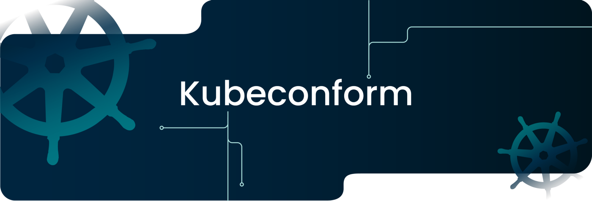
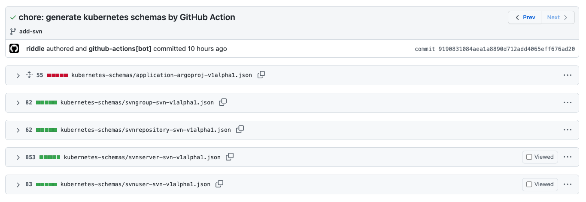

# title

こんにちは。ミクシィの 開発本部 SREグループ の [riddle](https://twitter.com/riddle_tec) です。

最近は Kubernetes Manifest のスキーマチェックができる `kubeconform` の布教活動をしています！

  

- [kubeconformを使ったKubernetes Manifestの型チェックをCIに仕込んでレビューを楽にしよう!](https://mixi-developers.mixi.co.jp/kubeconform-2bb477371e06)
- [kubeconform の asdf プラグインを作成しました](https://mixi-developers.mixi.co.jp/asdf-kubeconform-aadc6c4acbae)

スキーマチェックは Manifest のミスを発見できるので、CI を非常に相性が良いです。しかし **<span style="color: #e04b9e">「新しい Manifest を追加したら、新しいスキーマを手動で追加する」</span>** のが面倒です。

具体的にはこれをしないといけません。

1. スキーマの存在しないカスタムリソース(CR)が含まれた Manifest を追加する
1. 追加した CR 用のスキーマを作成する

面倒ですし、忘れることも多いですね！

なので GitHub Actions で **<span style="color: #e04b9e">「自動でスキーマを追加する」</span>** ようにしました！ ということで今回は **<span style="color: #e04b9e">kubeconform のスキーマを自動で用意する方法</span>** を紹介します。


# 前提条件

スキーマと Manifest は以下のディレクトリレイアウトで保存しています。

```sh
.
├── kubernetes-schemas
│  ├── gen-schema.sh
│  ├── openapi2jsonschema.py
│  └── xxxx.json
│
└── manifests
   ├── argocd
   │    ├── base
   │    │  ├── v2.2.3-0
   │    │  │  └── upstream
   │    │  │     ├── download.sh
   │    │  │     ├── README.md
   │    │  │     └── upstream.yaml
   │    │  └── v2.3.0-0
   │    │     └── upstream
   │    │        ├── download.sh
   │    │        ├── README.md
   │    │        └── upstream.yaml
   │    ├── development
   │    │  ├── kustomization.yaml
   │    │  └── xxx.yaml
   │    ├── production
   │    └── staging
   ├── cert-manager
   │
 〜省略〜
```

注目していただきたいのは `manifests/argocd/base/v2.2.3-0/upstream/upstream.yaml` です。

私達の環境では Helm と kustomize を使っており、リモートの manifest や Chart をすべてローカル(Git)に保存しています。（`upstream.yaml` という名前です)

Custom Resource Definition (CRD) は外部パッケージ(ここでは `upstream.yaml`)に格納されていることがほとんどのため、このファイルからスキーマを生成できます。

※ただし、クラウドプロバイダーから提供される CRD (EKS や GKE 特有のものなど)や、Operator で提供されているもの、自分で CRD を作成している場合はこの方法が使えないので、個別に対応する必要があります。

# スキーマの生成方法

kubeconform リポジトリの [openapi2jsonschema.py](https://github.com/yannh/kubeconform/blob/master/scripts/openapi2jsonschema.py) を使うと簡単にスキーマを作成できます。

```sh
export FILENAME_FORMAT='{kind}-{group}-{version}'
./openapi2jsonschema.py upstream.yaml

JSON schema written to xxx-xxx-v1.json
```

より詳細な手順や仕組みはこちらの記事をご覧ください。
- [kubeconformを使ったKubernetes Manifestの型チェックをCIに仕込んでレビューを楽にしよう!](https://mixi-developers.mixi.co.jp/kubeconform-2bb477371e06)

私たちは環境変数のつけ忘れるを避けるたいのでシェル (`gen-schema.sh`) でラップしています。

```sh
#!/bin/bash
export FILENAME_FORMAT='{kind}-{group}-{version}'
./openapi2jsonschema.py $@
```

この 2 つのファイル (`openapi2jsonschema.py` / `gen-schema.sh`) を `kubernetes-schemas` ディレクトリ配下に格納します。

# GitHub Actions の設定

```yaml
name: generate kubernetes schema
on:
  push:
    branches:
      - '**'        # matches every branch
      - '!main'     # excludes main
    paths:
      - 'manifests/**/upstream.yaml'

jobs:
  generate-schema:
    runs-on: ubuntu-20.04
    name: generate kubernetes schema from crd
    steps:
      - name: checkout
        # https://github.com/actions/checkout/releases/tag/v2.4.0 相当
        uses: actions/checkout@ec3a7ce113134d7a93b817d10a8272cb61118579

      - name: generate kubernetes schemas
        run: |

          cd kubernetes-schemas

          # 同じ CRD が複数の upstream.yaml で定義されている場合上書きされてしまう。
          # そのため upstream.yaml を timestamp でソートして、
          # 一番新しい upstream.yaml の CRD で schema を上書きさせる。
          find ../manifests -name upstream.yaml \
            | xargs ls -tr \
            | xargs ./gen-schema.sh

      - name: commit and push
        # https://github.com/EndBug/add-and-commit/releases/tag/v7.4.0
        uses: EndBug/add-and-commit@d77762158d703e60c60cf5baa4de52697d1414a3
        with:
          message: "chore: generate kubernetes schemas by GitHub Action"
          committer_name: "github-actions[bot]"
          committer_email: "41898282+github-actions[bot]@users.noreply.github.com"
          push: true
```

上記のファイルを `.github/workflows/generate-k8s-schemas.yaml` で保存します。(名前は何でも良い)

これで完成です。

# GitHub Actions の動き

GitHub Actions では以下の処理を行っています。

1. Pull Request(mainブランチ以外) が飛んできたら `gen-schema.sh` を実行
1. 差分があればコミットを作成
1. 対象のブランチに Push

新しい Manifest(`upstream.yaml`)を追加/修正すると、このようにスキーマが自動生成されます。

  

便利ですね！！！！

# まとめ

- `kubeconform` を利用したスキーマチェックは便利！
- ただしスキーマを用意するのは面倒…
- Manifest ファイルを Git に格納して、GitHub Actions で自動生成しよう！


便利なのでぜひ導入してみてください。

- [kubeconformを使ったKubernetes Manifestの型チェックをCIに仕込んでレビューを楽にしよう!](https://mixi-developers.mixi.co.jp/kubeconform-2bb477371e06)
- [kubeconform の asdf プラグインを作成しました](https://mixi-developers.mixi.co.jp/asdf-kubeconform-aadc6c4acbae)
