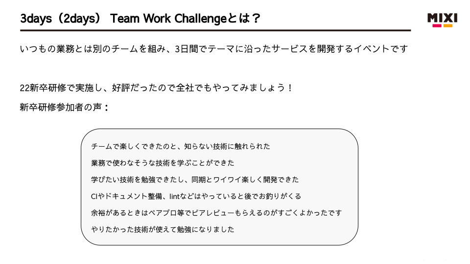
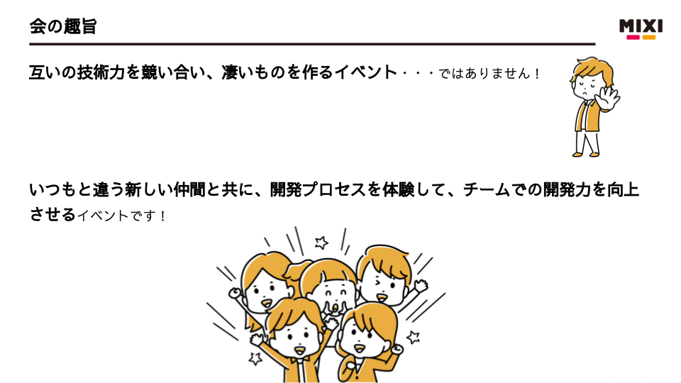
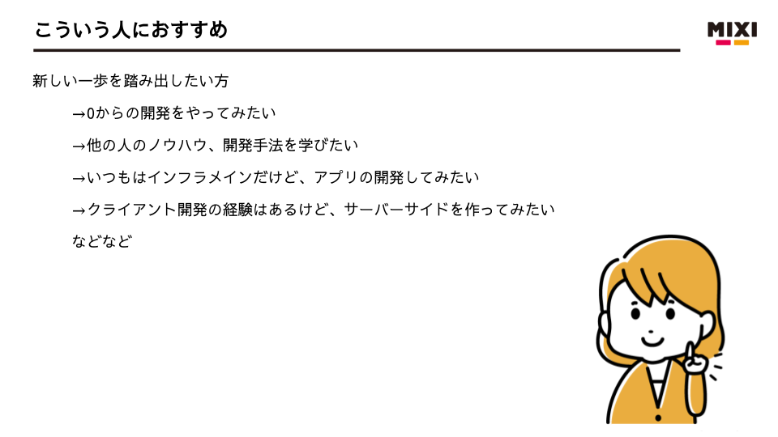
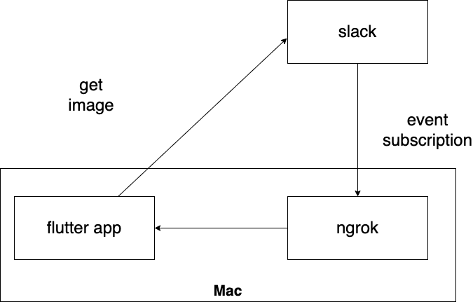

# title

こんにちは。MIXI 開発本部 SREグループの [riddle](https://twitter.com/riddle_tec) です。

今回は、弊社で開催した社内ハッカソン「Team Work Challenge」に参加したので、振り返りと作ったものを紹介します。

## Team Work Challenge とは？

弊社の新人研修で元々実施していたハッカソンを、全社員を対象にやってしまおうとイベントです。（挙手制）

理念や概要はこんな感じです。（3人でチームを組む)

  

  

  

こういう面白そうなイベントには目がないので riddle も参加してみることにしました。

普段は SRE としての活動が多いのでコーディングできるの面白そうですしね。

## やったこと

ハッカソンでのテーマは **「リアルタイムコミュニケーション」** というお題でした。

テーマをもとにチームで話したところ、リモートワークにおけるコミュニケーションロスが結構しんどいという話があがり、Slack の times チャネルっていいアイデアだよね〜という話が出ました。

> slackの機能とかそういうのではないのですが、
> 各々が個人のチャンネルを持ち、自由に発言していく場(channel)です。
>
> 呟くことに特に制限はなく、様々なことを呟くことができます。
> [slackのtimes導入のすすめ - Qiita](https://qiita.com/w-tdon/items/e2ed168ced63dffa6035)

困ってる人をすぐに察知するには便利な仕組みなのですが、は人数が増えてくると能動的に見に行くのが大変という話が出てきました。確かに10人〜もいたらみるのも大変ですね。

ということで「もっと気軽に timesチャネルを見たい！」というのをテーマに掲げ、新幹線の電光掲示板をテーマに開発を行いました。

https://youtu.be/jRH-4rvWlG4

## 使用技術 / 構成

- Slack App
- Flutter 

Slack の Event Subscription を ngrok 経由で Flutter App に渡して描画しています。画像の取得を行うために、Slack にも問い合わせたりしています。

※ngrok : ローカルで稼働しているサービスを外部公開できるサービス

  

## 感想

はじめて Flutter を触ったのですがクライアントアプリがすごく簡単に作れたのが感無量です。
今時の GUI アプリ作成はこんなに手軽なのかが知れたのでいい機会でした。（環境構築も楽だった）

また普段アプリ開発をしているチームメンバーの地力を感じるシーンがたびたびあり、もっと勉強しないとな〜と思ったのもいい収穫です。

弊社の devrel チームがまた開催してくれるとのことなので、次も参加したいと思います。
