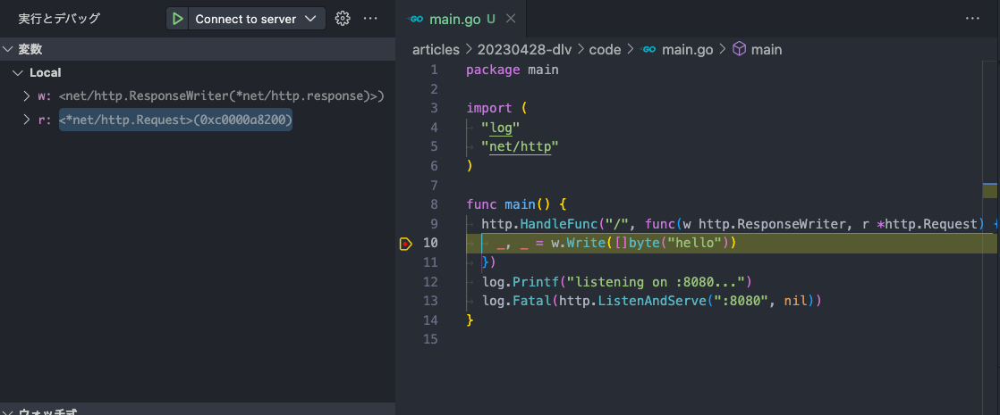

# title

こんにちは。MIXI 開発本部 SREグループの [riddle](https://twitter.com/riddle_tec) です。

# dlv を利用した Kubernetes 環境でのリモートデバッグ

この記事で紹介されているデバッグ方法が便利だなーと思っていました。
- [Kubernetes上のGoアプリケーションにデバッガーを接続する](https://zenn.dev/castaneai/articles/debugging-go-application-on-kubernetes)

簡単に紹介すると `Skaffold` を使ってデバッガー(dlv)を仕込んでいるのですが、自分たちの環境では別のビルド&デプロイの方式を採用しており、パッと `Skaffold` が導入できないので断念していました。

ただリモートデバッグができるととても楽なので、紹介されていた `skaffold debug` コマンド調べたところ、シンプルなことしかやっていなかったので力技で同じことができることがわかりました。

ということでこの記事では、
`Skaffold` を使わずにリモートデバッグを実現する方法を紹介します。


## 前提

- Kubernetes を利用
- Go アプリの Pod をデプロイしている

## アプリ

※サンプルコードを [Kubernetes上のGoアプリケーションにデバッガーを接続する](https://zenn.dev/castaneai/articles/debugging-go-application-on-kubernetes) からお借りします

```go
package main

import (
	"log"
	"net/http"
)

func main() {
	http.HandleFunc("/", func(w http.ResponseWriter, r *http.Request) {
		_, _ = w.Write([]byte("hello"))
	})
	log.Printf("listening on :8080...")
	log.Fatal(http.ListenAndServe(":8080", nil))
}
```

8080 で listen する web サーバーを [lirlia/sample-go-web:latest](https://hub.docker.com/repository/docker/lirlia/sample-go-web/general) でコンテナイメージにしておいたのでこれを使います。

Dockerfile はこれ。

```dockerfile
FROM golang:1.19 as builder
WORKDIR /go/src/app
COPY go.mod .
COPY main.go .
run CGO_ENABLED=0 go build -o /bin/main main.go

FROM scratch
COPY --from=builder /bin/main /main
ENTRYPOINT ["/main"]
```

## Kubernetes へのデプロイ

通常デプロイするにはこのような manifest を使いますね。(Deployment じゃないのは簡便化のためです)

```yaml
apiVersion: v1
kind: Pod
metadata:
  name: dlv-test
spec:
  containers:
    - name: dlv-test
      image: lirlia/sample-go-web:latest
      imagePullPolicy: IfNotPresent
      ports:
        - containerPort: 8080
```

しかし今回はデバッグをしたいのでカスタマイズします。
それがこちらです。

```yaml
apiVersion: v1
kind: Pod
metadata:
  name: dlv-test
spec:
  initContainers:
    - image: gcr.io/k8s-skaffold/skaffold-debug-support/go
      imagePullPolicy: IfNotPresent
      name: install-go-debug-support
      volumeMounts:
        - mountPath: /dbg
          name: debugging-support-files

  volumes:
    - emptyDir: {}
      name: debugging-support-files

  containers:
    - name: dlv-test
      command:
        - /dbg/go/bin/dlv
        - exec
        - --headless
        - --continue
        - --accept-multiclient
        - --listen=:56268
        - --api-version=2
        - /main
      image: lirlia/sample-go-web:latest
      imagePullPolicy: IfNotPresent
      ports:
        - containerPort: 8080
          protocol: TCP
        - containerPort: 56268
          name: dlv
          protocol: TCP
      volumeMounts:
        - mountPath: /dbg
          name: debugging-support-files
```

何をやっているかというと、コンテナが起動する前に `gcr.io/k8s-skaffold/skaffold-debug-support/go` イメージで init container を起動し、dlv コマンドを `/dbg` に保存しています。

このパスは、`dlv-test` にマウントされているので、`dlv-test` では dlv コマンドを使えるようになりました。

```yaml
  initContainers:
    - image: gcr.io/k8s-skaffold/skaffold-debug-support/go
      imagePullPolicy: IfNotPresent
      name: install-go-debug-support
      volumeMounts:
        - mountPath: /dbg
          name: debugging-support-files
```

そして dlv 経由で先ほどの web サーバを起動します。

```yaml
      command:
        - /dbg/go/bin/dlv
        - exec
        - --headless
        - --continue
        - --accept-multiclient
        - --listen=:56268
        - --api-version=2
        - /main
```

これによりポート56268 経由でデバッグができるようになるので、ポートを開けておきます。

```yaml
        - containerPort: 56268
          name: dlv
          protocol: TCP
```

## ポートフォワードをしてみる

これでローカルの 56268 にポートが転送されます。

```sh
❯ kubectl port-forward dlv-test 56268:56268 8080:8080

Forwarding from 127.0.0.1:56268 -> 56268
Forwarding from [::1]:56268 -> 56268
Forwarding from 127.0.0.1:8080 -> 8080
Forwarding from [::1]:8080 -> 8080
```

ではデバッグをしてみましょう。

## VScode でデバッグしてみる

私は VScode を使っていますが、他のエディターやコマンドラインでも同様のことができると思うので「dlv 好きなツール名」で検索してください。

`launch.json` を以下のように設定し、F5で実行します。

```json
{
  "version": "0.2.0",
  "configurations": [
    {
      "name": "Connect to server",
      "type": "go",
      "request": "attach",
      "mode": "remote",
      "substitutePath": [
        {
          # ローカルのコードが存在するパス
          "from": "${workspaceFolder}/articles/20230428-dlv/code",
          # Dockerfile の内でのコードのパス
          "to": "/go/src/app",
        }
      ],
      # 先ほど port forward した値
      "port": 56268,
      "host": "0.0.0.0"
    }
  ]
}
```

実行するとフッターにこのように表示されます。

  

続いて今回のコードにブレイクポイントを設定します。 `_, _ = w.Write([]byte("hello"))` にブレイクポイントを設定しましょう。

```go
package main

import (****
	"log"
	"net/http"
)

func main() {
	http.HandleFunc("/", func(w http.ResponseWriter, r *http.Request) {
		_, _ = w.Write([]byte("hello"))  // ←ここにブレイクポイントを設定
	})
	log.Printf("listening on :8080...")
	log.Fatal(http.ListenAndServe(":8080", nil))
}
```

そうしたらローカルから `curl localhost:8080` でリクエストを送ります。リクエストを送った後に、このようになれば成功です。

  

ブレイクポイントを素通りしてコンソールに「hello」が表示されてしまう場合は、`launch.json` の `substitutePath` が間違っている可能性があるので見直してください。

※注意点： HTTPのタイムアウトや、Context タイムアウトが設定されているとデバッグ中にキレることがありますので調整してみてください

## 最後に

Kubernetes 上で動く Go アプリにリモートデバッグをする方法を紹介しました。実際の環境でしか起こらないバグなどの改修に役に立つと思うので、使ってみてください！
