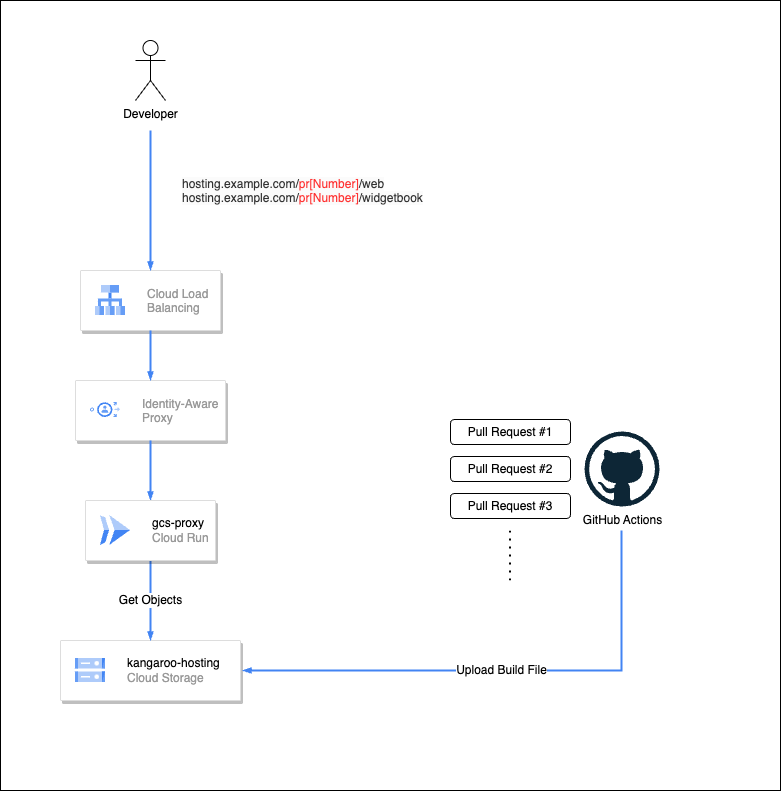
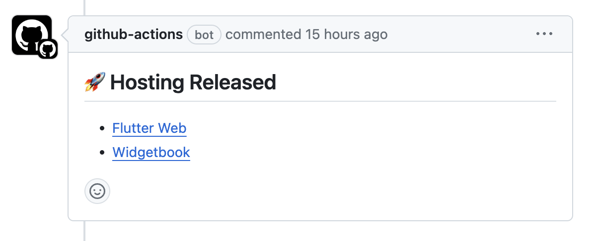

# Flutter on the Web と WidgetBook を Pull Request 単位でセキュアに公開する

こんにちは。MIXI 開発本部 SREグループの [riddle](https://twitter.com/riddle_tec) です。

**今年から Flutter エンジニアになります！**

とはいえ Flutter のことはまだよくわからないので、いままでの知識をいかしつつクライアントチームに貢献していければと思います。

ということで最初は **Flutter on the Web と WidgetBook を GitHub Pull Request 単位でセキュアに公開する** というお仕事です。

## やりたかったこと

いち早く見た目や機能触ってもらうために `Flutter on the Web` と `WidgetBook` といった機能・ツールを使っています。

`Flutter on the Web` は Flutter のコードを Web に変換してくれるツールで、`WidgetBook` は Flutter の Widget をカタログ化してくれるツールです。

- [Flutter on the Web](https://flutter.dev/multi-platform/web)
- [Widgetbook](https://www.widgetbook.io/)

これらを GitHub Pull Request(以下PR) 単位で公開することで、簡単に見た目や機能を確認できるようにしたいと思いました。

単にホスティングするだけであれば `Firebase Hosting` が便利に使えるのですが、この製品は認証ができずに誰でもアクセスできてしまうので、セキュアに公開することができません。

そこで以下のようなアーキテクチャで PR 単位でセキュアに公開することを目指しました。

## アーキテクチャ



1. PR を作成
2. PR hook で GitHub Actions でビルドした成果物を Google Cloud Storage(以下GCS) にアップロード
3. 閲覧者は https://hosting.example.com/pr番号/web にアクセスし、Identity-Aware Proxy(以下IAP) の認証を通ることで成果物を確認できる

## やったこと

### 1. GitHub Actions でビルドした成果物を GCS にアップロード

GitHub Actions でビルドした成果物を GCS にアップロードするために、以下のような workflow を作成しました。

```yaml
name: upload hosting files
on:
  pull_request:

concurrency:
  group: ${{ github.workflow }}-${{ github.ref }}
  cancel-in-progress: true

jobs:
  build:
    permissions:
      contents: read
      id-token: write # for google cloud auth
      pull-requests: write # for write comment

    runs-on: ubuntu-latest
    steps:
      - uses: actions/checkout@v4
        with:
          fetch-depth: 0

      - name: Setup Google Cloud
        uses: ~omit~ (workload identity setting)

      - uses: Setup Flutter
        uses: ~omit~

      - name: Generate Files
        run: |

          prefix="pr${{ github.event.number }}"
          echo "PREFIX=${prefix}" >> "$GITHUB_ENV"

          flutter build web \
            -t lib/widgetbook.dart \
            --output build/widgetbook \
            --base-href "/${prefix}/widgetbook/"

          flutter build web \
            --output build/web \
            --dart-define=flavor=xxxx \
            --web-renderer canvaskit \
            --base-href "/${prefix}/web/"

      - name: Upload Files
        run: |

          # delete for clean up gcs cache
          gsutil -q ls "gs://xxx-hosting/$PREFIX" && gsutil -m -q rm -r "gs://xxx-hosting/$PREFIX"

          gsutil -m -q cp -r build/widgetbook "gs://xxx-hosting/${PREFIX}/"
          gsutil -m -q cp -r build/web "gs://xxx-hosting/${PREFIX}/"

      - name: Write a comment
        uses: thollander/actions-comment-pull-request@v2.4.3
        with:
          message: |
            ## :rocket: Hosting Released
            - [Flutter Web](https://hosting.example.com/${{ env.PREFIX }}/web/index.html)
            - [Widgetbook](https://hosting.example.com/${{ env.PREFIX }}/widgetbook/index.html)

          comment_tag: execution
```

やってることはシンプルで、ビルドして GCS にアップロードするだけですが、いくつかポイントがあったので紹介します。

- `--base-href "/${prefix}/widgetbook/` を設定することで生成された静的ファイルのパスを変更しています。これをしないと、`/widgetbook/index.html` にアクセスしたときに関連ファイルが見つからず、正しく表示されませんでした。
- `gsutil -m rm` で GCS のキャッシュを削除しています。これをしないと、同じ PR で何度もビルドしてもキャッシュが残ってしまい、最新の成果物が反映されませんでした。

成功すると PR に以下のようなコメントが書き込まれます。


ちなみにアップロードしたファイルの削除は GCS のライフサイクルで設定しています。

### 2. インフラ環境の準備

セキュアに公開したいので、Identity-Aware Proxy(以下IAP) を使って認証を通しつつ GCS の成果物を公開する方法を考えました。

こちらの記事([Google Cloud Storage をロードバランサーのバックエンドにしつつ、直接はアクセスさせたくない場合](https://medium.com/google-cloud-jp/private-cloud-storage-bucket-for-load-balancing-3975c1d2b743))で紹介されているように、GCS へのアクセスを制御する簡単な方法は 2024/01/10 時点で Google Cloud からは提供されていないようです。

そこで、GCS にアクセスするため [domZippilli/gcs-proxy-cloud-run](https://github.com/domZippilli/gcs-proxy-cloud-run) を利用し Cloud Run を経由して GCS にアクセスするようにしました。

そして LoadBalancer 経由でのみ Cloud Run にアクセスできるようにし、IAP で認証を通すことでセキュアに公開することができました。

これで特定のユーザーのみが PR の成果物を確認できるようになりました。

インフラの完成！


## まとめ

FlutterKaigi 2023 の公式サイトが Flutter on the Web で作られていると聞き、勉強の一環でコードを漁ってたところ `--base-href` というオプションを見つけることができこの構成が思い浮かびました。(元々はサブドメイン＋ワイルドカード証明書で対応しようとしていた)

まだ、Flutter エンジニアとしてはまだまだ勉強中ですが、これからは Flutter を使っていろいろなことに挑戦していきたいと思います。
