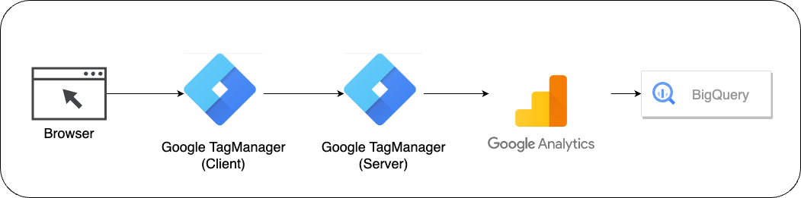
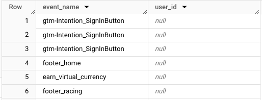
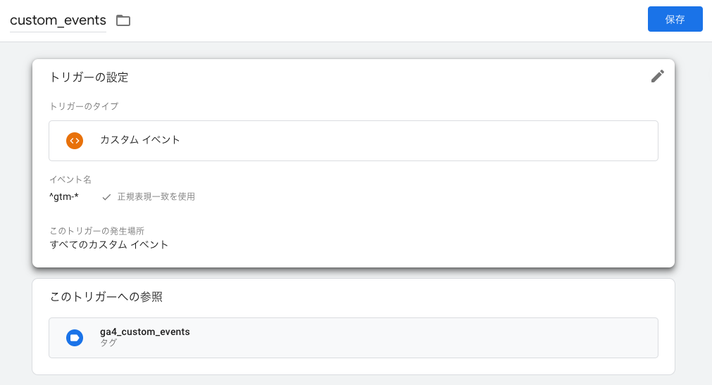
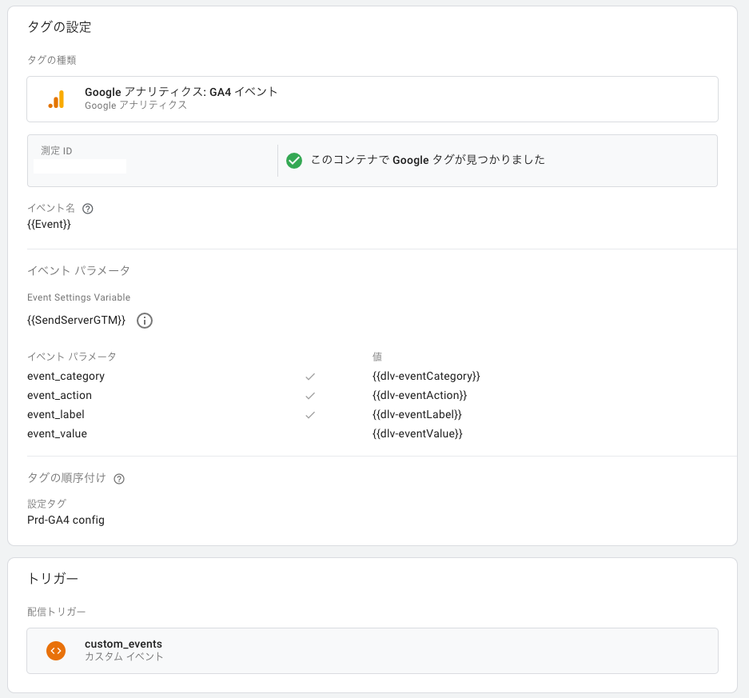
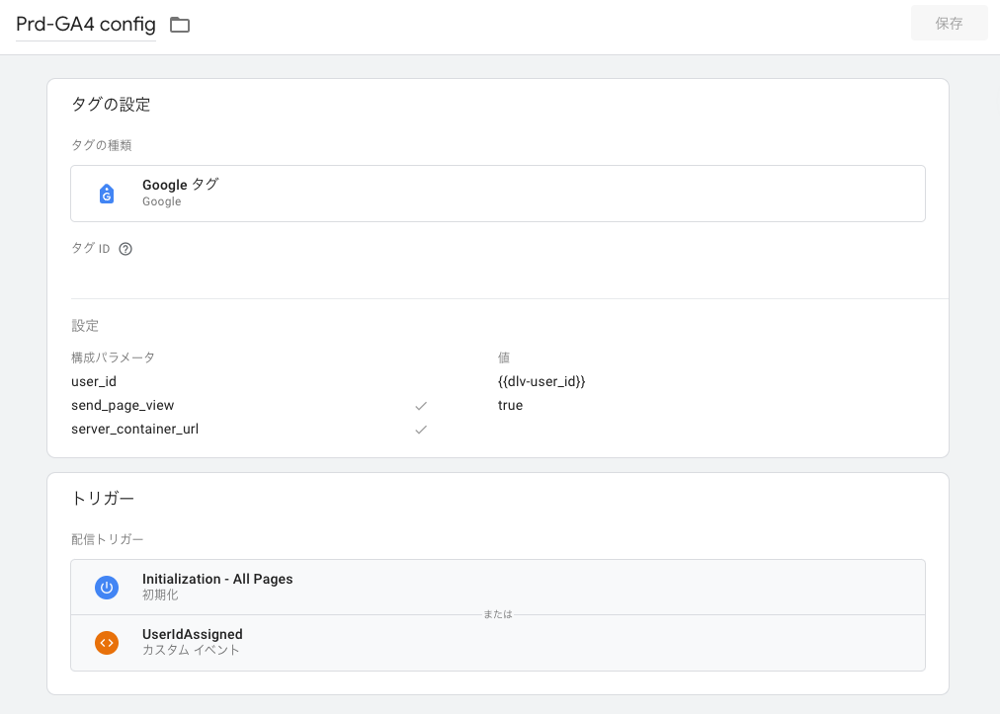
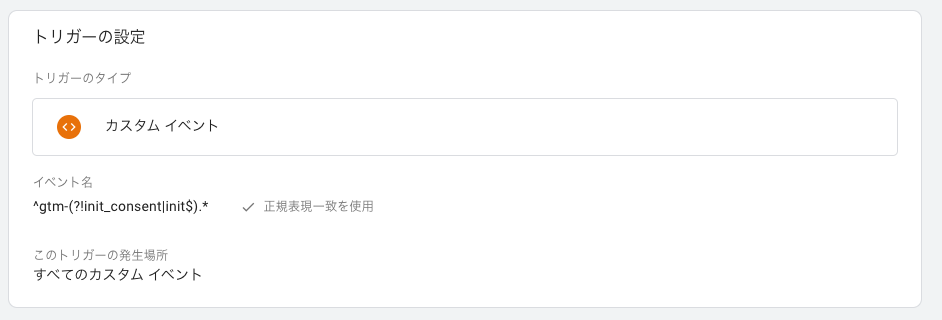
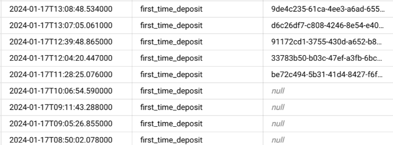

# title

こんにちは。MIXI 開発本部 SREグループの [riddle](https://twitter.com/riddle_tec) です。

今回は Google Tag Manager(以下GTM)、Google Analytics、BigQuery を使ってる環境で、BigQuery 内のデータに `user_id` が付与されなかった問題とその対応について紹介します。

# 構成

以下のような構成で Google Tag Manager を利用していました。


クライアント側の負荷軽減のためサーバサイドGTMを利用していますが、移行中のためクライアントGTMで受けたイベントをすべてサーバサイドGTMに送信しています。

# 発生した問題

ある日、Looker でデータを確認していたところ `user_id` が null になっているイベントが発生していることに気づきました。




# その時の クライアントGTM の設定

クライアントGTM の設定は以下のようになっていました。

カスタムイベント


カスタムタグ


簡単に説明するとこれは `gtm-` で始まるすべてのイベントをサーバサイドGTMに送信するという設定です。そして順序タグでは Google タグを先に呼ぶようにしています。



これは `gtm-*` イベントが先に発火してしまうと、Google タグが発火が遅れることで `session_start` や `first_visit` イベントが送信されない問題があったためです。

`user_id` はユーザがログインしたタイミングで送信され、`UserIdAssigned` イベントでハンドリングして DataLayer に保存しています。そのため、このイベントの以後はすべてのイベントに `user_id` が付与されるはずでした。

実際に `user_id` を送ってるコード。

```js
window.dataLayer?.set({
  event: 'user_id',
  user_id: resUser.data.user?.user_id,
})
```

# `user_id` が付与されなくなっていた原因

原因は `gtm-*` イベントが送信されると、毎回 Google タグが発火してしまうことでした。公式ドキュメントには以下のように書かれています。

> GA4 イベントタグでは、Google タグのパラメータが継承されます。Google タグで設定されたパラメータは、ページで発生するすべてのイベントで静的に保持されます。パラメータが更新されるのは、Google タグが再び配信された場合（通常、次回のページ読み込み時）のみです。
>
> https://support.google.com/tagmanager/answer/9442095?hl=ja

つまりGoogle タグを複数回よんでしまったことで、DataLayer の `user_id` が `null` に上書きされてしまったのです。

まとめると
1. session_start や first_visit イベントが送信されない問題があったため、`gtm-*` イベントよりも前に Google タグを先に発火させるようにした
2. その結果 `gtm-*` イベントが発火すると毎回 Google タグが発火してしまい、`user_id` が `null` に上書きされてしまった

# 対応

順序タグが問題であれば、順序タグを使わなければいいのではないかと思いましたが、そうすると `session_start` や `first_visit` イベントが送信されない問題が再発してしまいます。

また、クライアントGTMを使わないという選択肢もありましたが、サーバサイドGTMの移行が完了していないためそれもできませんでした。

ということで次善の策を考えました。

[公式サイト](https://support.google.com/tagmanager/answer/7679319?hl=ja&ref_topic=7679108&sjid=6070946981679941328-AP)によると、GTM のページビュートリガーは以下の順番で発火します。

1. 同意の初期化 (`gtm.init_consent`)
2. 初期化(`gtm.init`)
3. ページビュー(`page_view`)
4. DOM Ready(`gtm.dom`)
5. ウインドウの読み込み(`gtm.load`)

今回問題になるのは `session_start` や `first_visit` イベントが送信されない問題です。これはどうやら `gtm.init` までイベントが発行されていれば解決するようです。

そこで、`custom_events` のイベント名を `^gtm-*` から `^gtm-(?!init_consent|init$).*` に変更しました。これは `gtm.init_consent` と `gtm.init` 以外の `gtm-*` イベントを送信するようにしたということです。



そして、`gtm.init` / `gtm.init_consent` はハンドリングされなくなったので、順序タグも削除しました。

これにより、`gtm-*` イベントが発火しても Google タグが発火しなくなり、`user_id` が `null` に上書きされることがなくなりました。



# まとめ

今回は Google Tag Manager を併用している環境で `user_id` が付与されなかった問題とその対応について書きました。

GTM を併用している場合、イベントの発火順序には注意が必要です。また、イベントの発火順序を変更する場合は、そのイベントがどのような影響を与えるかをよく考えてから変更するようにしましょう。
