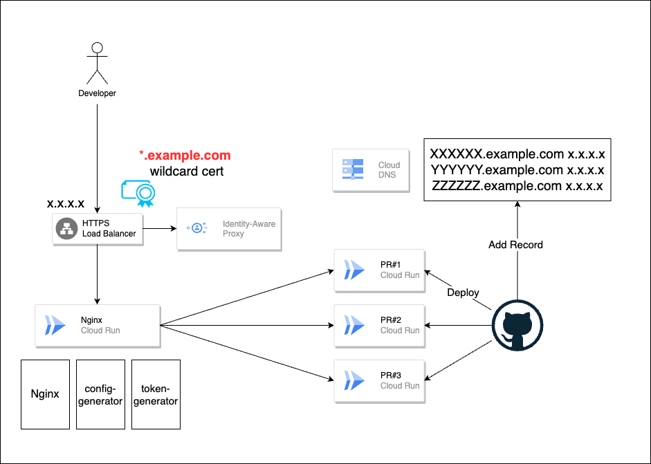
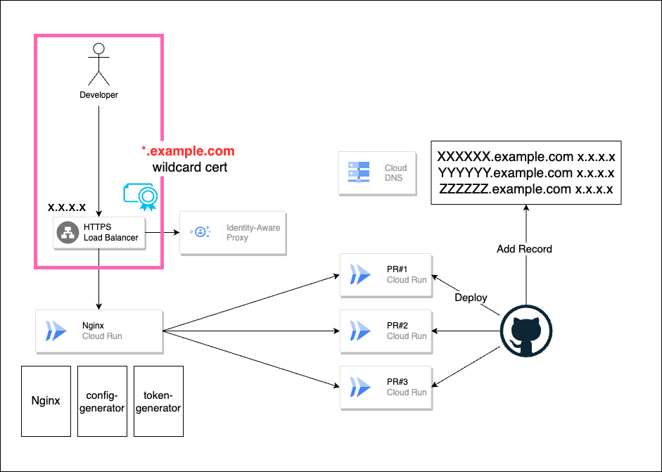
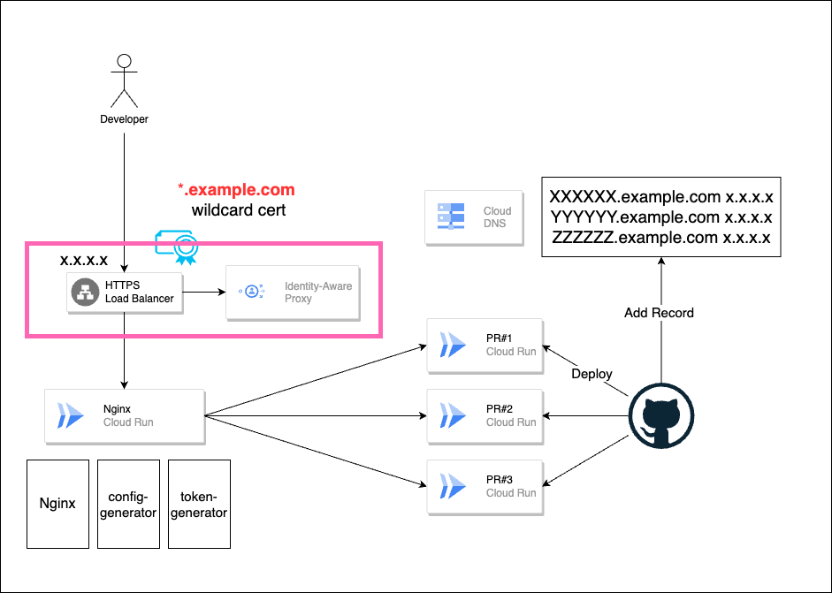
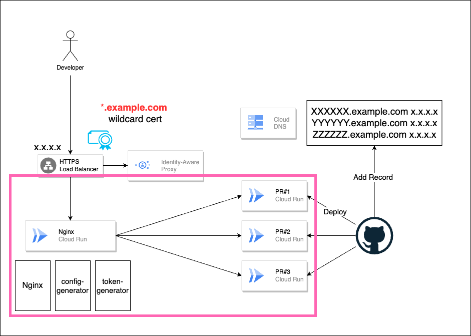

# title

こんにちは。MIXI 開発本部 SREグループの [riddle](https://twitter.com/riddle_tec) です。

以前 [Flutter on the Web と WidgetBook をGCSを使って Pull Request 単位にセキュアに公開する | MIXI DEVELOPERS](https://medium.com/mixi-developers/hosting-flutter-on-gcs-d4355d0e5612) という記事を書きましたが、今度は Cloud Run で同じことをやってみます。

## 作った全体の構成



環境作成は以下のようになります。

1. GitHub に PR が作られる
2. GitHub Actions が Cloud Run をデプロイ、この時 Cloud Run の URL `https://XXXXX.run.app` の `XXXXX` の部分を取得
3. GitHub Actions が `XXXXX.example.com` を、LoadBalancer(以下LB) が使ってる IP アドレスを使ってAレコードを追加

アクセスは以下のようになります。
1. Developer が `https://XXXXX.example.com` にアクセス
2. Identity-Aware Proxy が Developer の認証/認可を行う
3. 認証/認可に成功すればアクセスできる。

## 仕組み

通信の流れに順に説明します。

### 1. Developer が `https://XXXXX.example.com` にアクセス



GitHub Actions が A レコードを登録しているため、Developer は `https://XXXXX.example.com` にアクセスすると、LB にアクセスが行きます。このとき HTTPS 通信のため、LB で SSL Termination が行われます。

Google Cloud の [Certificate Manager](https://cloud.google.com/certificate-manager/docs/overview?hl=en) を使用するとワイルドカード証明書を発行できるので、こちらを使い `*.example.com` に対して証明書を発行しています。これにより、どのようなサブドメイン(例: `https://hogehoge.example.com`)に対しても証明書の検証が行えるようになります。

### 2. Identity-Aware Proxy が Developer の認証を行う


Identity-Aware Proxy を使うことで、Developer の認証/認可を行うことができます。そのためアクセスさせたい Developer の Google アカウントに `httpsResourceAccessor` 権限をつけておきます。

### 3. Nginx による Cloud Run へのリバースプロキシ


Identity-Aware Proxy で認証/認可が成功すると、Nginx による Cloud Run へのリバースプロキシが行われます。このとき、Nginx は `https://XXXXX.run.app` に対してリバースプロキシを行います。ここが結構職人芸です。

このようなコンフィグを書いています。

```
# default Cloud Run Resolver is 169.254.1.1
# but this resolver is not work on Cloud Run to resolve subdomain.a.run.app
resolver 8.8.8.8;

server {
    listen 80;
    server_name  ~^(?<subdomain>.+)\.xflag\.net$;
    location / {

        # set Authorization header by /token/auth_token
        rewrite_by_lua_block {
            local file = io.open("/token/auth_token")
            io.input(file)
            local data = io.read()
            io.close()
            ngx.req.set_header("Authorization", "Bearer "..data);

            local subdomain = ngx.var.subdomain
        }

        # forwarding
        proxy_pass https://$subdomain.a.run.app;
        proxy_set_header Host $subdomain.a.run.app;
        proxy_set_header X-Real-IP $remote_addr;
        proxy_set_header X-Forwarded-For $proxy_add_x_forwarded_for;
        proxy_set_header X-Forwarded-Proto $scheme;

        # remove X-Serverless-Authorization header
        # IAP add requester account's OIDC ID Token to this header
        # and this header use by Google Front End instead of Authorization header
        proxy_set_header X-Serverless-Authorization "";
    }
}
```

いくつかポイントがあります。

Cloud Run に元々設定されている DNS resolver は `subdomain.a.run.app` を解決できないため、resolver を外部に向けています。

```
# default Cloud Run Resolver is 169.254.1.1
# but this resolver is not work on Cloud Run to resolve subdomain.a.run.app
resolver 8.8.8.8;
```

Cloud Run にアクセスする場合には Cloud Run Invoker をもつアカウントの ID Token を Authorization ヘッダにつける必要があります。そこで、`/token/auth_token` に ID Token を書き込んでおき、Nginx で Authorization ヘッダに設定しています。

※アイデア元: https://zenn.dev/shin5ok/articles/abe99ad833aeee#nginx%E3%81%AE%E8%A8%AD%E5%AE%9A

```
rewrite_by_lua_block {
    local file = io.open("/token/auth_token")
    io.input(file)
    local data = io.read()
    io.close()
    ngx.req.set_header("Authorization", "Bearer "..data);

    local subdomain = ngx.var.subdomain
}
```

そして、`X-Serverless-Authorization` ヘッダは Cloud Run にリクエストを送るときに IAP が付与するヘッダです。このヘッダはがついていると、Google Front End が Authorization ヘッダを無視して `X-Serverless-Authorization` ヘッダを優先的に使用するため削除しておきます。

```
# remove X-Serverless-Authorization header
# IAP add requester account's OIDC ID Token to this header
# and this header use by Google Front End instead of Authorization header
proxy_set_header X-Serverless-Authorization "";
```

- [Authenticating service-to-service  |  Cloud Run Documentation  |  Google Cloud](https://cloud.google.com/run/docs/authenticating/service-to-service?hl=en)

### 4. Cloud Run へのリクエスト

Cloud Run はインターネットに公開＋ Require authentication で起動しているため通常はアクセスできませんが、Nginx が Authorization ヘッダをつけてリクエストを送ることでアクセスできます。

これにより Developer は Cloud Run にアクセスできるようになります。

## Cloud Run の yaml ファイル

実際に使った Cloud Run の yaml ファイルは以下のようになります。

```yaml
apiVersion: serving.knative.dev/v1
kind: Service
metadata:
  annotations:
    run.googleapis.com/ingress: internal-and-cloud-load-balancing
    run.googleapis.com/launch-stage: BETA
  labels:
    cloud.googleapis.com/location: asia-northeast1
  name: pr-cloudrun-with-iap
spec:
  template:
    metadata:
      annotations:
        autoscaling.knative.dev/maxScale: "1"
        run.googleapis.com/container-dependencies: '{"proxy":["config-generator", "token-generator"]}'
    spec:
      # add Cloud Run Invoker Role / Storage Object Viewer Role
      serviceAccountName: pr-cloudrun@[YOUR_PROJECT].iam.gserviceaccount.com
      containerConcurrency: 80
      containers:
        - name: proxy
          image: openresty/openresty:latest
          ports:
            - containerPort: 80
              name: http1
          resources:
            limits:
              cpu: 1000m
              memory: 512Mi
          startupProbe:
            tcpSocket:
              port: 80

          volumeMounts:
            - name: token
              readOnly: true
              mountPath: /token
            - name: config
              readOnly: true
              mountPath: /etc/nginx/conf.d

        - name: config-generator
          image: gcr.io/google.com/cloudsdktool/google-cloud-cli:slim
          command: ["/bin/sh"]
          args:
            - "-c"
            - |

              cat << "EOF" > /config/proxy.conf

              # default Cloud Run Resolver is 169.254.1.1
              # should be changed to resolve subdomain.a.run.app
              resolver 8.8.8.8;

              server {
                  listen 80;
                  server_name  ~^(?<subdomain>.+)\.xflag\.net$;
                  location / {

                      # set Authorization header by /token/auth_token
                      rewrite_by_lua_block {
                          local file = io.open("/token/auth_token")
                          io.input(file)
                          local data = io.read()
                          io.close()
                          ngx.req.set_header("Authorization", "Bearer "..data);

                          local subdomain = ngx.var.subdomain
                      }

                      # forwarding
                      proxy_pass https://$subdomain.a.run.app;
                      proxy_set_header Host $subdomain.a.run.app;
                      proxy_set_header X-Real-IP $remote_addr;
                      proxy_set_header X-Forwarded-For $proxy_add_x_forwarded_for;
                      proxy_set_header X-Forwarded-Proto $scheme;

                      # remove X-Serverless-Authorization header
                      # IAP add requester account's OIDC ID Token to this header
                      # and this header use by Google Front End instead of Authorization header
                      proxy_set_header X-Serverless-Authorization "";
                  }
              }
              EOF

              # Start a simple HTTP server for keep container
              mkdir -p /server
              cd /server
              echo "I'm alive" > index.html
              python3 -m http.server 8081

          # / is redirect to other cloud run service
          # so, use tcp probe instead of http probe
          startupProbe:
            tcpSocket:
              port: 8081

          volumeMounts:
            - name: config
              readOnly: true
              mountPath: /config

        - name: token-generator
          image: gcr.io/google.com/cloudsdktool/google-cloud-cli:slim
          command: ["/bin/sh"]
          args:
            - "-c"
            - |
              # create first, and avoid no file error
              gcloud auth print-identity-token > /token/auth_token

              # Start a simple HTTP server for keep container
              mkdir -p /server
              cd /server
              echo "I'm alive" > index.html
              python3 -m http.server 8082

              # update token every 3500 seconds
              # because token is expired after 3600 seconds
              while true; do gcloud auth print-identity-token > /token/auth_token ; sleep 3500; done

          startupProbe:
            tcpSocket:
              port: 8082

          volumeMounts:
            - name: token
              readOnly: true
              mountPath: /token

      timeoutSeconds: 300
      volumes:
        - name: token
          emptyDir:
            medium: Memory
        - name: config
          emptyDir:
            medium: Memory
  traffic:
    - latestRevision: true
      percent: 100
```

こちらもポイントをいくつか紹介します。


Cloud Run に付与する ServiceAccount ですが、Cloud Run Invoker Role と Storage Object Viewer Role を付与しています。なぜか公式イメージを GCR から取得するために Storage Object Viewer Role が必要だったのでそれも付与しています。

```
# add Cloud Run Invoker Role / Storage Object Viewer Role
serviceAccountName: pr-cloudrun@[YOUR_PROJECT].iam.gserviceaccount.com
```

この YAML では sidecar 2 つを含む3つのコンテナを起動しています。

1. `proxy`: Nginx によるリバースプロキシ
2. `config-generator`: Nginx のコンフィグを生成するコンテナ
3. `token-generator`: Cloud Run Invoker の ID Token を生成するコンテナ

1 は先ほど説明した通りです。補足すると Lua を使えるようにするため初めからさまざまな 3rd party module を含んだイメージ([openresty](https://openresty.org/en/))を使っています。

2 は 1 で利用する Nginx のコンフィグを生成するためのコンテナです。Kubernetes では ConfigMap をつかってコンフィグを渡すことができますが、Cloud Run では ConfigMap が使えません。しかしコンフィグの変更のために毎度イメージを生成するのが面倒だったので、コンフィグを生成するコンテナを用意しました。

ちなみに `run.googleapis.com/container-dependencies: '{"proxy":["config-generator", "token-generator"]}'` を設定しているので、`proxy` は `config-generator` と `token-generator` のコンテナが起動してから起動するので確実に作成したコンフィグを使うことができます。

3 は Cloud Run 接続用の ID Token を生成するためのコンテナです。先ほど Nginx の Authorization ヘッダにつけた ID Token には Cloud Run Invoker の Role が付与されている必要があるので、Cloud Run 自身につけている ServiceAccount の権限を使って ID Token を生成しています。

生成した ID Token は 1時間で期限が切れるため、コンテナ起動時に ID Token を生成しその後余裕を持って更新するため 3500 秒ごとに ID Token を更新するようにしています。

```
while true; do gcloud auth print-identity-token > /token/auth_token ; sleep 3500; done
```

そしてコンフィグと ID Token は Volume を使ってコンテナ間で共有しています。これにより 1 の Nginx がコンフィグと ID Token を使えるわけです。

```yaml
volumes:
  - name: token
    emptyDir:
      medium: Memory
  - name: config
    emptyDir:
      medium: Memory
```

ちなみに 2 も 3 もやっていることはシンプルなのですが、なんらかのポートを Listen しないとコンテナが落ちてしまうため、適当にHTTP サーバを起動しています。

```
# Start a simple HTTP server for keep container
mkdir -p /server
cd /server
echo "I'm alive" > index.html
python3 -m http.server 8082
```

あとはこれをつかって `gcloud run services replace proxy.yaml` でデプロイすればOKです。

## まとめ

今回は Cloud Run で Pull Request 単位にセキュアに公開する方法を紹介しました。Cloud Run はサーバレスであるため、サーバの管理が不要でとても便利です。

Nginx によるリバースプロキシが若干職人芸になってしまったので、もう少し簡単にできる構成があればぜひ教えてください。

## 参考

- [Flutter on the Web と WidgetBook をGCSを使って Pull Request 単位にセキュアに公開する](https://medium.com/mixi-developers/hosting-flutter-on-gcs-d4355d0e5612)
- [Certificate Manager overview  |  Google Cloud](https://cloud.google.com/certificate-manager/docs/overview?hl=en)
- [Authenticating service-to-service  |  Cloud Run Documentation  |  Google Cloud](https://cloud.google.com/run/docs/authenticating/service-to-service?hl=en)
- [Cloud Run で サーバーレス GCS Proxy](https://zenn.dev/shin5ok/articles/abe99ad833aeee#nginx%E3%81%AE%E8%A8%AD%E5%AE%9A)
- [OpenResty® - Open source](https://openresty.org/en/)
- [Cloud Run YAML Reference  |  Cloud Run Documentation  |  Google Cloud](https://cloud.google.com/run/docs/reference/yaml/v1)
- [gcloud auth print-identity-token  |  Google Cloud CLI Documentation](https://cloud.google.com/sdk/gcloud/reference/auth/print-identity-token)
