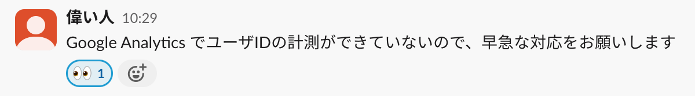
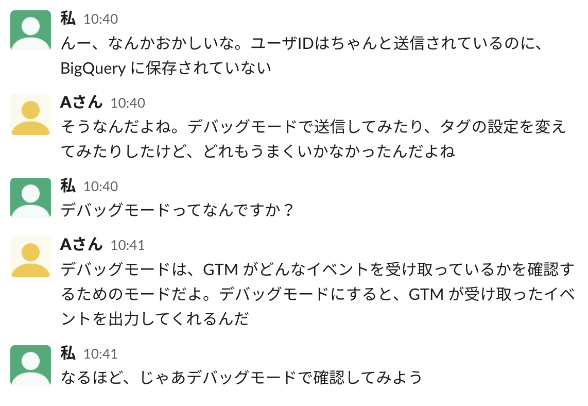
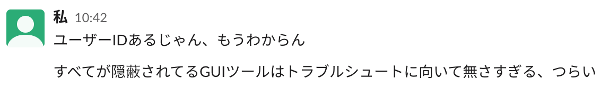

# title

こんにちは。MIXI 開発本部 SREグループの [riddle](https://twitter.com/riddle_tec) です。

脚色をいれたりしているので、実際の出来事とは異なる部分があります。

# 混乱の始まり

ある日 Slack をみていたら、こんなメッセージが流れてきた。

自分宛に飛んできたメッセージではなかったが、複数の方から同じようなメッセージが流れてきていたので、何かあったのだろうと思い ~~興味本位で~~ 流れを追ってみることにした。

どうやら、**Web 経由でアクセスしたユーザのユーザIDが Google Analytics に計測されておらず、広告の効果測定ができていない** ということらしい。これにより、広告の効果がわからなくなってしまうため **早急な対応** が必要とのことだった。

とはいえ、Google Analytics(以下GA) も一緒に使っているらしい Google Tag Manager(以下GTM) も触ったこともないので、どうやって計測しているのかもわからない。とりあえず温度感が高そうだったので **絵文字だけつけた** 。

みてますよ、という意思表示だ。

~~この後やるかどうかはわからないが~~とりあえずGTM や GA にはアクセス権限が必要なので権限の付与をお願いしておいた。

## 詳しい人に聞いてみる

とりあえずここのあたりに詳しいAさんに聞いてみることにした。

Aさんはこの環境で使っている GA と GTM について説明してくれた。どうやら色々なサービスを使っているらしく、それらを組み合わせてユーザの行動を計測しているらしい。

またこの問題は以前から発生しているようで、さまざまな方法を試してみてはいるがどれもうまくいっていないとのことだった。とりあえず時間に余裕があったので、彼に説明してもらいながら、どうやって計測しているのかを調べてみることにした。

とりあえず、GA と GTM について調べた。といってもよくわからないので、Google 検索で **「GA ユーザID ついてない」** とか **「GTM ユーザID ついてない」** 調べたり、ChatGPT で似たようなことを聞いてみたりしたが、とくに有益な情報は得られなかった。

埒が開かないので、基本からAさんに聞いてみることにした。

Aさんは、GTM はタグを管理するためのサービスで、タグはユーザの行動を計測するためのものだと教えてくれた。

Aさんは、タグは GTM に設定することで、GTM がユーザの行動を計測するようになると教えてくれた。その他にも我々の構成の説明や、実際にイベントを送信しているフロントエンド側のコードを見せてくれた。

という感じで、Aさんに色々と教えてもらいながら、どうやってユーザIDを計測しているのかを調べてみることにした。

とりあえずこの時点でわかっていることをまとめ、Slack に書き込んでおいた。なんかしらコメントがあれば、依頼している人も多少安心するかもしれないと思ったからだ。

## 全然わからない

とりあえず全体の流れを把握するために、Aさんに説明してもらった内容をまとめてみた。

1. ユーザがログインすると、フロントエンド側でユーザIDをイベントとして送信する
2. GTM がそのイベントを受け取り、GA に送信する
3. GA がそのイベントを受け取り、BigQuery に保存する
4. BigQuery に保存されたイベントを Looker で可視化する

実際に BigQuery を見てみると確かにユーザIDが欠損していることがわかった。しかし、GTM に送信されているイベントを見てみると、ユーザIDはちゃんと送信されていることがわかった。

ということでAさんから教えてもらった [Tag Manager Assistant](https://chromewebstore.google.com/detail/tag-manager-assistant/oacpegaegonlmnobkoeiiegdccgcmpnj) をインストールして、デバッグモードで確認してみることにした。

すると確かにユーザIDが送信されていることがわかった。

その後、GTM や GA のいろんなそれっぽい設定を変えてみたが、どれもうまくいかなかった。後ここで気づいたが、QA環境と本番環境の設定がそもそも違っていた。とりあえず、本番環境の設定をQA環境と同じにしてみたが、やはりうまくいかなかった。

とりあえず、ここまでの流れをまとめて Slack に書き込んでおいた。なんかしらコメントがあれば、依頼している人も多少安心するかもしれないと思ったからだ。(2回目)

## アプローチの変更

色々試したけど、どれもうまくいかなかったので、アプローチを変えることにした。

そもそもこれはいつから起きたのかということを調べてみることにした。これの調査は簡単で、BigQuery に保存されているイベントを見ればわかる。

それっぽいクエリを書いてみると、どうやら2023年10月19日から起きているようだった。当時の記録を見てみると、どうやら GTM の設定を変更したらしい。ということで、その設定を見てみることにした。

じゃあその設定を **「revert すればよくね？」** と思ったが、そうもいかなかった。というのもその設定は別の問題を解決するために行われたもので、それを revert すると別の問題が発生してしまうからだ。

とりあえず、ここまでの流れをまとめて Slack に書き込んでおいた。なんかしらコメントがあれば、依頼している人も多少安心するかもしれないと思ったからだ。(3回目)

この日はもう時間がなかったので、ここまでで終わりにした。帰りに **「GTM の本でも買うか」** と思ったが、GTM について書かれた本はなかったので買うのはやめた。(厳密には GA の本に数ページだけ書かれていたが、GTM の内容が薄すぎて買うのはやめた)

## 次の日

前に [世界一流エンジニアの思考法](https://www.amazon.co.jp/%E4%B8%96%E7%95%8C%E4%B8%80%E6%B5%81%E3%82%A8%E3%83%B3%E3%82%B8%E3%83%8B%E3%82%A2%E3%81%AE%E6%80%9D%E8%80%83%E6%B3%95-%E7%89%9B%E5%B0%BE-%E5%89%9B/dp/4163917683) という本を読んだ時に、すごい人でも新しいことを理解する時には基礎から積み上げるということを書いてあったので、GTM について基礎から学ぶことにした。(これで一流エンジニアになれるかもしれない)

GTM とはなんなのか、タグとは、イベントとは、どうやってイベントを発行するかなどを調べてみた。急がば回れというやつだ。そして revert すると発生する別の問題についても調べてみた。といっても過去の Slack を見てみただけだが。

すると **よくわからないけどなんかわかった気がした。**

とりあえず、GTM について調べたことをまとめて Slack に書き込んでおいた。なんかしらコメントがあれば、依頼している人も多少安心するかもしれないと思ったからだ。(4回目)

そろそろ Slack のスレッドも長くなってきたので一度整理のために GitHub Issue に事象やわかったこと、調べたことをまとめておいた。

その過程でとある仮説が浮かんだ、やっぱり整理は大事だ。

## そして解決へ

仮説を試す方法はいくつかあるのだが、一番ちゃんとしているやつは対応が大変すぎるのであきらめて、一番簡単な方法を試すことにした。(簡単な方法だけど具体的な設定は ChatGPT に考えてもらった)

QA環境で試してみたところユーザIDがちゃんと保存された。ということは、本番環境でその方法を試せば、ユーザIDが保存されるはずだ。

(完全に理解していない)

ということで本番環境にその方法を適用してみたところ、ユーザIDが保存されるようになった。

問題は解決した。

とりあえずエビデンス付きで Slack に書き込んでおいた。ちゃんと前の問題も含めて直っていることも書いといた。

## おわりに

**手探り → 基礎知識を知る → 仮説立てて → 試して → 解決** という流れで問題を解決することができた。よくまずは仮説を立ててから試せと言われるが、今回は知識がないところからだったので、手探りで試してみてなんとなくツールのことがわかってから、基礎知識を知ることで効率よく知識が入ってきたと思う。このやり方をぜひおすすめしたい。

またこれぐらいの規模だとインシデントハンドリングのように司令塔と実行者を分けることもないので、自分で両方の役割をこなすことが求められる。ということでトラブルシュート時に共通的に使える考え方をまとめておく。

- トラブルシュートの緊急度やビジネスインパクトを聞く
- ググったり、ChatGPT に聞いたり、Google でさっと調べる。ない場合は急がば回れ対応。(サポート問い合わせもする)
- 詳しそうな人に聞く(環境、設定、コードなど)
- 並行して必要な権限を取得しておく
- 事象の切り分けをする(どこまでデータが飛んでるのか、どこまで保存されているのかなど)
- 逐一 Slack に書き込んでおく(依頼している人も安心するし、自分の整理にもなる)
- デバッグ環境を整える(用意する)
- 問題をデバック環境で再現させ、試せるようにする。自動化が必要なら自動化する
- アプローチ方法に拘らず、複数の方法を試す(事象から、時間から、環境から、設定から、コードから、など)
- トライアンドエラーをおそれないで試す(可能性を潰していく)
- 必要なところで AI に聞く(ChatGPT はすごい)
- 時間を取れるようにする。他のタスクを調整する(調整してもらう)

## おまけ

具体的な問題や解決方法はこちらの記事で紹介しているので興味があればどうぞ。

- [Google Tag Manager で取得したイベントに BigQuery では user_id が付与されていない問題](https://medium.com/mixi-developers/gtm-c8a83049b5c1)
